# Development

## Technical Research Prototyping

### P1 – Python Web Framework

#### Prototype Purpose

Starting the initial prototyping stage of this project, it was necessary to investigate and select a suitable Python web framework that aligned with the requirements of Integrated Workforce Management Platform. One essential feature required for the core functionality of the project is the ability to handle concurrent/simultaneous actions throughout the platform due to its account-based usage and constant access requirements. To deliver this feature there is a requirement for an asynchronous capable web framework, meaning its ability to handle concurrent I/O operations. These I/O operations, classified as operations reading/writing data outside of its CPU, include database queries, authentication checks, and background schedule updates – all features that would have to be performed regularly and possibly simultaneously in a large-scale deployment. Contrastingly, a synchronous framework would heavily struggle with the demanding constant usage, as execution – i.e. the carrying out of tasks – would be blocked while waiting for a currently occurring operation to complete, reducing Integrated Workforce Management Platform’s ability to handle many simultaneous requests at once. Furthermore, due to the projects nature as a web-based system, structured and predictable communication between the client and server side is essential. One specific method of assuring these predictable communications is making sure that the chosen web framework can be RESTful, with standardised HTTP methods to represent actions on resources. Furthermore, by assuring a RESTful approach, the concept of statelessness is also a requirement, meaning each request includes all authorization and context – disregarding the need for a server-side session state. This further improves concurrency of users without significant strain on the hardware due to less information being stored – a feature perfect for Integrated Workforce Management Platform. While the implementation of such standards falls on the developer, the capability must be evident in the framework to be implemented effectively.

#### Method Identification

Therefore, I took to researching different frameworks, some of which I had used in the past and some of which were new to me. Several potential frameworks were considered based on my prior experience and use, including Flask, Django, FastAPI, and Sanic. However, only one framework exhibited the ideal combination of ease of use, flexibility and performance capabilities required for this project. The following section will identify and evaluate the features of each shortlisted framework in the justification of the final selection. 

While Flask is lightweight, beginner-friendly, has a very low learning curve, and is highly suitable for small scale applications, it is primarily synchronous in nature. As explained above, causing significant issues in relation to simultaneous execution of requests and actions on the webapp. Although asynchronous behaviour can be added or emulated using its highly-extensive extensions – this unnecessary layer of abstraction and complication significantly reduces the ease of use and increases the timescale needed in its configuration, making it a non-viable option for this project.

Due to Flask not being a fit, the investigation moved onto Django. Django is a well-known, widely used comprehensive full stack web framework, offering many built in features such as authentication, database, and admin systems, potentially accelerating development times and reducing unnecessary programming. Further research into the framework suggests significant constraints as a result of deviations from standards which would not be known to me, the sole developer, due to lack of experience in said framework which is also known to have a steep learning curve. Furthermore, this enforced structural nature of the framework also reduces flexibility in the creation of a REST-based API, placing it against one of the predefined requirements I set out in search of a web framework. Finally, while newer versions of Django do have asynchronous support, a large portion of its extensions and above described built in features are not combatable, highly reducing efficiency and concurrency benefits – making it an evidently less appropriate option for this project. 

As a result of Django’s limitations FastAPI was considered, an asynchronous Python web framework designed specifically for high performance and RESTful API development, providing native solely asynchronous support, request validation and ease of development through the use of the newly released Python type hints feature – allowing the assignment of data types and structures to variables, creating visible and traceable warnings in the text editor as a result of mistakes. These features call for FastAPI to be a strong candidate for Integrated Workforce Management Platform, seemingly implementing all requirements detailed above perfectly. However, the framework has a significant focus on enforcing strict definitions and extensive documentation requirements, which, while highly beneficial in a corporate, team-based environment, calls for a highly steep learning curve at adoption and additional complexity during development sessions. Due to this project’s requirements, greater control over request handling and minimal abstraction is preferred. 

Due to this, the focus of my investigation moved onto Sanic, a lightweight, asynchronous Python web framework “Built from the ground up with speed and scalability as a main concern”  Unlike Flask and Django, Sanic is natively asynchronous without the need for the addition of extensions or additional layers to handle concurrent operations, adhering to the requirements of a asynchronous framework. The framework also provides full control over request handling, unlike FastAPI and Django – which enforce strict developmental rules, and excessive documentation requirements – allowing for RESTful implementation without enforced constraints. This level of flexibility is greatly valuable, due to the need of authentication management, operation scheduling and database interactions, all of which would be made much more complex in a strictly enforced environment. Additionally, Sanic has a “highly intuitive API with smart defaults”  which is highly inspired by one of the most popular frameworks, Flask, a framework I have significant prior experience with, reducing the learning curve while still benefiting from asynchronous execution. Finally, the framework has useful built-in development tools such as automatic reload on file changes – which will evidently be useful in the development of the frontend - and clear debugging error pages which further reduces development problems, streamlining development and testing workflows.

#### Programmed Implementation

To solidify my understanding of Sanic, and assure myself of its suitability for Integrated Workforce Management Platform, I wrote a prototype RESTful API endpoint to demonstrate its capabilities. This initial prototype was minimal, focusing only on validating Sanic’s core use cases and suitability for the project. Establishing this, was a significant requirement, ensuring that further prototypes had a functional and usable base to build upon. Allowing development risk to be reduced and securing the base decision for subsequent stages of prototyping and development.

```python
from sanic import Sanic
from sanic.response import json
from sanic.request import Request

app = Sanic("ExampleApp")

@app.get("/hello")
async def hello(request: Request):
    return json({"message": "Hello World"})

if __name__ == "__main__":
    app.run(host="localhost", port=8000, dev=True)
```

This developed prototype demonstrates exactly how Sanic handles HTTP requests (in this case a `GET` request hosted at the `‘/hello’` endpoint) asynchronously as seen by the use of the `async` keyword before the function definition, ensuring that the server is not blocked when handling requests. Furthermore, the use of decorator-based routing - `@app.get(“hello”)` – forces endpoints to be clearly defined and supporting a RESTful structure – in which resources are accessed through standard HTTP methods. Additionally, the frameworks’ ability to run the same server for use in development and production environments – demonstrated through its `dev=True` parameter, which enables both the debugging UI and automatic file reloading, within the `app.run` API – further reduces development complexity. Finally, its optional inclusion of Python’s modern type hints through its accessible importable types – evident in the importation `from sanic.request import Request` and its subsequent use in the route function definition parameters `async def hello(request: Request):` - increases developer ease of use through text editor integration and readability, highly beneficial when maintaining a large codebase independently.

As a result of all prior outlined requirements being met, developer ease of use being prioritised, and its balance between useability and structure. Sanic was chosen as the most appropriate framework for the final implementation of Integrated Workforce Management Platform.

### P2 – Client-Server Architecture

#### Prototype Purpose

For the second prototype, the main purpose was to investigate different architectures and how applicable they would be in the implementation of Integrated Workforce Management Platform. A justified decision is crucial in ensuring the project is scalable, can support concurrent users and allow for modular and maintainable development practices throughout the project.

#### Method Identification

There are many possible options in the development of an application, with local-only approaches – meaning all data would be stored on the user’s machine – and monolithic single server applications meaning all components of the application were to reside together running as one process, rather than the frontend and backend being developed and deployed independently. 

Both these options can be seen to be inappropriate for Integrated Workforce Management Platform, as in the case of a local only approach – multi-user implementation would be inherently impossible due to its lack of a central convergence of data – and while a monolithic application would be considered to be easier initially, the large scope of the Integrated Workforce Management Platform’s capability, maintaining and extending the codebase throughout development iterations would become increasingly difficult as the codebase increased in scale.

Considering these limitations, a client-server approach was chosen for Integrated Workforce Management Platform. This allows for the frontend and backend to be run and developed independently of each other and simplify deployment and scaling through its architecture allowing the server to manage centralised resources (in this case through the backend) efficiently. This also assures security due to all data, logic and computation being performed and held on the server side, without risk of alteration on the aforementioned client side – reducing the possibility of the doctoring of schedules and hours worked, preventing inaccurate payroll reports. Furthermore, this architecture inherently supports separate testing of each area of the application, with the client side and server side being separate, reducing developer testing workload. To confirm the implementation of the approach, a minimal exemplar prototype was developed, showcasing the interactions between the backend framework and a mock frontend example.

#### Programmed Implementation

This prototype and example output, shown below, consists of a backend endpoint – written in Sanic, the chosen framework in Prototype 1 – that returned mock data and a frontend page – written in html and JS – that requested – through the JS fetch API – and displayed this data. This demonstrates the client, and server would be capable of communicating correctly, validating the use of this client-server approach, improving my understanding of this architecture and showing that it can handle basic request-response cycles as expected. A process essential to the core base of Integrated Workforce Management Platform.

```python
from sanic import Sanic
from sanic.response import json
from sanic.request import Request

app = Sanic("ExampleApp")

@app.get("/hello")
async def hello(request: Request):
    return json({"message": "Hello World"})

if __name__ == "__main__":
    app.run(host="localhost", port=8000, dev=True)
```

Above is the same minimal implementation of a Sanic development server presenting an exemplar `‘/hello’` route hosted on `localhost:8000` ready for requests by the client.

Following the server-side code, below is a minimal example of a client-side implementation written in pure HTML and JavaScript, which would be able to be ran on any modern web browser. 

```html
<!DOCTYPE html>
<html lang="en">
<head>
    <meta charset="UTF-8">
    <title>Client-Server Prototype</title>
</head>
<body>
    <h1>Server Message:</h1>
    <p id="message">Loading...</p>

    <script>
        // Fetch data from the backend endpoint
        fetch('http://localhost:8000/hello')
            .then(response => response.json())
            .then(data => {
                document.getElementById('message').textContent = data.message;
            })
            .catch(error => {
                console.error('Error fetching data:', error);
                document.getElementById('message').textContent = "Failed to load message.";
            });
    </script>
</body>
</html>
```

This prototype above, requests data from the backend route `/hello` hosted at `localhost:8000`, this fetch request is facilitated by JavaScript’s Fetch API – as seen by this line `fetch('http://localhost:8000/hello')`. It then proceeds to identify and single out the message field provided by the JSON response of the backend and replaces a pre-identified field in the HTML body of the webpage with said message – this is evident in this line `document.getElementById('message').textContent = data.message;`. 

Furthermore, though my inclusion of error handling in the client-side prototype, failed server requests are demonstrated how to be handled effectively in response to connection issues – ensuring issues in a real-world implementation do not break the frontend. This error handling can be seen to be implemented via the catch clause inside the fetch function, shown isolated below:

```python
            .catch(error => {
                console.error('Error fetching data:', error);
                document.getElementById('message').textContent = "Failed to load message.";
            });
```


After catching said error, it handles it gracefully, pushing an error message to the console and replacing the <p id="message">Loading...</p> text field with an error message. Notifying the user and preventing total usability of the webpage.

Figure 1 aside shows the output of the above-mentioned client-side prototype, where the message “Hello World” returned from the server is displayed in the browser. 

Together, these backend and frontend examples perfectly capture and exemplify the successful implementation of a client-server system, fetching data from the backend and displaying it dynamically directly in a stand-alone frontend system. This proves the client server architecture is suitable for Integrated Workforce Management Platform, supporting security and the system’s ability to scale with additional functionality in subsequent prototypes. 

### P3 – Frontend Framework

#### Prototype Purpose

The purpose of this third prototype was to understand and investigate the suitability of different frontend approaches for the implementation of Integrated Workforce Management Platform. The selected frontend framework must adhere to several requirements identified because of the various core features of Integrated Workforce Management Platform and their resultant needs in implementation. Due to the systems nature as an account-based platform, the frontend must be capable of managing; user state efficiently, frequent data requests, regular data updates and dynamic content rending – the process of requests being done in the background (known technically as asynchronous data rendering) without page reloads and visible discontinuity. This behaviour is important to maintain user flow and discourage abandoning of tasks due to unresponsiveness and perceived system latency.

#### Method Identification

Several frontend approaches were considered during this investigation, ranging from static implementations through the use of vanilla HTML and JavaScript to modern component-based frameworks such as Angular or ReactJS. Each successive option was evaluated in relation to its scalability, responsiveness, maintainability and ability to integrate with a RESTful backend implementation – as seen to be necessary in Prototype 1.

One possible approach considered for the frontend implementation was the use of plain HTML and JavaScript without the inclusion of any libraries or frontend frameworks. This approach can be considered to be the most lightweight implementation option. As a result of the lack of need for external dependencies or build tools, initial setup complexity was heavily reduced – a significant positive for this project due to its nature of being developed by a singular developer. Furthermore, it provides full native control over the DOM (Document Object Model – the interface that represents web pages as trees of dynamic objects allowing scripts to modify it), covering all possible functionality directly through native browser implementation, reducing significantly the possibility of issues that could be introduced through an intermediary framework. Despite these numerous advantages, various significant limitations were identified. As the system increases in complexity, managing a large file structure using only vanilla technologies becomes increasingly difficult, resulting in repeated use of code rather than reusable components as is standard in various libraries, culminating in large file sizes. Furthermore, plain JavaScript provides no mechanism for managing user state and data on an application scale, other than native technologies such as cookies, making the handling of authentication status and coordination of frequent backend data updates much more complex. Therefore, dynamic content rendering would become inherently more complex, due to its manual implementation being a requirement, causing the further repetition of code and increasing the likelihood of logical errors. Additionally, while RESTful communication between the client and server is technically a possibility when using vanilla solutions, all request handling and error management would need to be directly implemented on a per request basis – reducing maintainability and scalability over time, two of the main requirements for a solution set out initially. For these aforementioned reasons, the use of plain HTML and JavaScript was deemed unsuitable for the frontend implementation of Integrated Workforce Management Platform.

Following this, my focus moved to JavaScript libraries such as jQuery, due to its simplification and bundling of common operations used in web development. While these features can be initially considered to be useful, its helper methods – such as those of AJAX requests – and its historical well supported and widely used nature, its focus on DOM manipulation as its core functionality can lead to further issues with code repetition as a result of its inability to separate repetitive reusable operations from explicit edits of the UI. Building on this, its lack of structured application state management inherently makes its unsuitable for complex user authentication and data management flows, which has previously been identified as a fundamental core functionality of Integrated Workforce Management Platform. Furthermore, the majority of the library’s functionality has been made redundant, with most features such as the AJAX request wrappers, being directly present in versions of vanilla JavaScript from 2015 onwards. Therefore, jQuery provides little to no benefit, being widely considered a legacy technology and an unnecessary external dependency with minimal optimisation, increasing page load size and as a result reducing performance statistics. Proving scalability, maintainability and optimisation to be further areas in which it is lacking; all features that are essential to the core functionality of Integrated Workforce Management Platform. As such jQuery is unsuitable for the project.

The third option considered was Angular, which is a fully featured frontend framework (the first framework on this list) including built in tools such as routing functionality to manage the pages internally without needing to maintain multiple servable documents (html files); a point of difference to the previous considered options. Angular also has built in request handling with HTTP client services considered central to the framework’s use cases proving its validity in an architecture based on client server request response; a factor previously outlined as essential for successful delivery of Integrated Workforce Management Platform. These factors make Angular a strong contender as the frontend framework for the project further reinforced by the fact that it improves code readability and error traceability through its enforcement of the use of the JavaScript superset, Typescript, and encourages clear separation of concerns throughout the frontend projects development through its isolation of visual components (the User Interface) and through services (methods that provide functionality to the components). This can be seen as a clear positive as it simplifies development as a whole, dividing two complex parts of frontend development, the implementation of the User Interface visually, and the communication with the backend (data, authentication and user state). Finally, Angular contains built in reactive programming capabilities, mitigating issues of repetitive implementation when dealing with exceptions or errors, through its feature “Observables”. This feature allows for the efficient handling of asynchronous requests on an application wide scale, a point of differentiation and a requirement of this project.

Despite these positives, Angular is more suited for use in large scale and enterprise development, with its comprehensive feature set and enforced structured nature (much of which is described above) in contrast being barriers to flexibility and development timescale in a single developer project such as Integrated Workforce Management Platform. This is evident in its enforced use of TypeScript which is a superset of JavaScript and has significant architectural differences in its syntax. When combined with the extensive feature set mentioned above, this creates a fundamental barrier to entry of the Framework – with the overhead of learning an entire significantly different superset, which many consider an entirely separate language, and the sheer number of architectural concepts and features to familiarise with and adhere to. Therefore, I considered this fundamental steep learning curve to be outside the scope of this project preferring to instead identify an option with both the ease of use of plain HTML and CSS combined with the separation of concerns prevalent in Angular.

My final option considered was ReactJS, a modern frontend JavaScript library designed for building dynamic and highly responsive user interfaces. Combining the structural advantages of frameworks such as Angular with the reduced setup complexity associated with other lightweight frontend solutions. Similarly to Angular, react benefits from a component-based architecture, allowing the frontend user interface to be divided into clearly separated, reusable components. This approach significantly improves maintainability and scalability, as individual components can be developed and tested individually. Furthermore, it significantly improves project management, allowing for the easy organisation and management of different areas of the project – a feature highly essential to Integrated Workforce Management Platform due to it being written by one sole developer, with significant scope constraints. 

React additionally implements state driven rendering through the use of a virtual DOM (a lightweight replication of the DOM for easier access in UI manipulation), meaning, as data changes throughout the application, only the specific components using newly refreshed data get reloaded (or rather re-rendered). This directly results in a smoother user experience in the application and further increases performance when compared to manual DOM manipulation approaches – with significantly less strain on the browser. These benefits would be particularly prevalent in applications requiring frequent application wide data updates, such as Integrated Workforce Management Platform – allowing for schedule updates and other data changes to take effect without delay. React’s reliance on asynchronous data fetching via capable native browser APIs allows for clean and efficient integration with RESTful backend implementations, aligning directly with the architecture explored in Prototype 1.

While React does require the use of external libraries to implement certain functionalities such as routing or advanced state management, this was a significant advantage rather than a limitation. Allowing the selection of libraries to be based on the immediate requirements of the project at hand, rather than the provision of a large, predefined toolset such as is done in Angular, further improves performance due to the lack of unnecessary overhead tools and enabling the direct evaluation of specific libraries impact and effect on performance by the developer – allowing for justified and evaluative decisions prior to implementation. Furthermore, this evident flexibility significantly lowers the barrier to entry in the use of React, requiring only fundamental and essential technologies to be learnt and implemented. 

Therefore, this flexibility, ease of RESTful integration, efficient state handling and a comparatively low barrier to entry, makes React the ideal choice and highly suitable for the frontend implementation of Integrated Workforce Management Platform. To confirm and widen my understanding of this technology, I chose to create two programmatic implementations, the first exampling its capabilities in its state-driven rendering and component-based user interfaces, and the second exploring its asynchronous data fetching capabilities and RESTful integration with the backend design chosen in Prototype 1. 

#### Programmed Implementation

The first example, identified below, demonstrates React’s component-based architecture – where the user interface can be divided into minimal components, encapsulating functionality with specific areas of the UI – a feature previously described to be essential to the management of such a large complex project such as Integrated Workforce Management Platform.

```jsx
import { useState } from "react";

function ClockInExampleComponent() {
  const [clockedIn, setClockedIn] = useState(false);

  function toggleClockedIn() {
    setClockedIn(prevClockedIn => !prevClockedIn);
  }

  return (
    <div>
      <h2>User Clocked In Status</h2>
      <p>Current status: {clockedIn ? "Clocked In" : "Clocked Out"}</p>
      <button onClick={toggleClockedIn}>
        {clockedIn ? "Clock Out" : "Clock In"}
      </button>
    </div>
  );
}

export default ClockInExampleComponent;
```


In the above example, the state of a user’s status – being either clocked in or out – can be seen to be managed through the `useState` hook, imported into the component for use through the line `import { useState } from "react";`. This allows data to be stored and updated without direct DOM manipulation. When the data’s value changes, React automatically re-renders only the effected component – in this case to switch the buttons label `{clockedIn ? "Clock Out" : "Clock In"}` and to switch the text shown in the ‘current status’ paragraph element `{clockedIn ? "Clocked In" : "Clocked Out"}`. Furthermore, these two implementations of text switching between different values, are an example of an additional React feature – inline JSX – allowing for logical decision making to take place inline, alongside traditional HTML tags. In this case the button element triggers the state change through the function `toggleClockedIn` attributed to the button through the React event `onClick`. This function, as seen in the line `setClockedIn(prevClockedIn => !prevClockedIn);` updates the state using the `setClockedIn` function defined alongside the state data above, a further React feature, through its use of the `!` operator, producing the opposite Boolean value to that of the current saved state. 

This approach, removes the need for explicit DOM queries and updates, exemplifying the previously explained reduction in code repetition and the likelihood of minor errors. Figure 2 demonstrates this behaviour at runtime, showing the component responding dynamically to state changes during user interaction.

This second programmed example demonstrates React’s ability to integrate with RESTful backend services using asynchronous HTTP requests, validating the decision making in the frontend library of choice through its integration with the client-server architecture identified in Prototype 2 and the exact backend programmed implementation utilised in Prototype 1.

```jsx
import { useEffect, useState } from "react";

function BackendTest() {
  const [backendMessage, setBackendMessage] = useState(null);
  const [loading, setLoading] = useState(true);
  const [serverError, setServerError] = useState(false);

  useEffect(() => {
    fetch("http://localhost:8000/hello")
      .then(response => response.json())
      .then(data => {
        setBackendMessage(data.message);
        setLoading(false);
        setServerError(false);
      })
      .catch(error => {
        console.error("Error fetching server data:", error);
        setLoading(false);
        setServerError(true);
      });
  }, []);

  if (loading) {
    return <p>Loading server data...</p>;
  }

  return (
    <div>
      {serverError ? (
        <p>Server request failed.</p>
      ) : (
        <p>Message from server: {backendMessage}</p>
      )}
    </div>
  );
}

export default BackendTest;
```

In this example, both useEffect and the previously covered useState are imported – as seen by this line import { useEffect, useState } from "react"; - with useState serving the same purpose as previously, and useEffect used to trigger a backend request when the component is first rendered. This prototype implementation mimics direct production implementations, which typically fetch initial data from the server at page load. This request for data from the server, located inside the useEffect hook, triggers an arrow function – as seen by this syntax () => {}, allowing the functionality of the hook to remain minorly abstracted. The request inside this arrow function, is made using JavaScript’s Fetch API – which is native to the browser, and can be seen to be fetching data from the backend endpoint () in an identical method to Prototype 2. There is multiple state variables defined via the previously discussed useState hook, managing various application states. The backendMessage state stores the message returned by the server, while the loading and serverError states are used to track the progress and outcome of the request, allowing the user interface to shift dynamically referencing the status of the request and its outcomes. While the request is in progress, the component leverages React’s conditional rendering, returning a loading message (as shown in figure 3a) based on the Boolean value of the loading state, ensuring the user receives immediate content, reducing perceived page load times, and preventing the display of incomplete data. On the result of a failed request, error handling logic contained in the catch block (.catch(error => {});) – a feature previously utilised in Prototype 2 – updates the serverError state, allowing the interface to render and display a clear failure message (as shown in figure 3c)  rather than a lack of data or dysfunctionality of the application. Finally, on the common occurrence of a successful request, the message returned by the backed, stored in backendMessage, is displayed to the user (as shown in figure 3b)  – as can be seen by this line <p>Message from server: {backendMessage}</p>, a further example of inline JSX through its use of state content in the UI component.

Figure 3 below presents the three previously discussed runtime states of the programmed example above, demonstrating the user interfaces capability in responding to loading, successful data retrieval and server error conditions.

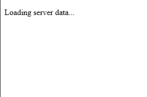

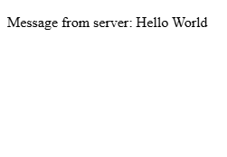


This programmed example above highlights React’s support for asynchronous data fetching and conditional rendering, allowing the frontend to remain responsive and informative during rare cases of backend failure. It also further illustrates benefit of its separation of concerns, with the backend communication logic isolated within the effect hook and presentation logic handled through the JSX response – an implementation of this isolation in a much more efficient method compared with previously considered options. 

As such the combination of both programmed examples and the prototype confirms that React is well suited to consuming RESTful APIs and maintaining a developer friendly and responsive user interface for Integrated Workforce Management Platform. 

### P4 – Database Integration

#### Prototype Purpose

The purpose of this fourth prototype was to investigate and programmatically demonstrate suitable database technologies and their theoretical implementations, building upon the previous prototypes, for the persistence of application data within Integrated Workforce Management Platform. As a result of the system’s account-based nature, the database solution was required to support structured data, reliable relationships between different data constructs and efficient querying – as to not slow down the usage of the application. Efficient querying being particularly important due to Integrated Workforce Management Platform’s inherent frequent requirement of data, with regular queries necessary on page loads to supply data such as employee schedules and user information. This prototype specifically focuses on the evaluation of effective integration of various persistent storage options, access methods and their subsequent integration with the predefined backend architecture identified in Prototype one.

#### Method Identification

Several database approaches were considered during this investigation, including relational (SQL based) and non-relational (NoSQL based) database models. 

One option for persistent storage throughout the application is a NoSQL database, while these take many forms, their fundamental principles minimally differ. NoSQL databases, such as MongoDB, store data in flexible, non-predefined structures such as documents or key-value stores. This can be seen to be a highly beneficial factor, with their flexibility being significantly advantageous in situations where data-structures change frequently and data relationships are minimal. Additionally, NoSQL databases are often optimised and designed with performance and scalability in mind, with their schema-less nature removing the forced and predefined structures evident in SQL databases, allowing data to be written and read with fewer constraints. 

However, as per the predefined requirements, Integrated Workforce Management Platform relies heavily on structured and relational data – such as hours worked and schedules being linked to specific users. With the implementation of such features in a NoSQL database being a significantly more difficult and manual task, requiring manual attribution between items of data at the application level rather than being implemented within the database itself, this would highly increase the already large scope of the project alongside its complexity, increasing the likelihood of logical errors. In which, when applied to this project, could surface as the misalignment of individual items of data – causing significant privacy issues, with Integrated Workforce Management Platform dealing with payment scales and personal information. For these reasons a NoSQL database was deemed unsuitable for this project, with the investigation moving to evaluate the efficacy of relational SQL based databases.

In contrast to NoSQL databases, their relational counterparts store data in clearly defined table structures, enforcing relationships through foreign keys and ensuring data integrity. These inherent design factors directly mitigate issues previously discussed, with the lack of manual implementation of relationships being highly beneficial in relation to this project, reducing developer workload and largely streamlining the development of the backend API. While NoSQL can be faster than relational SQL databases for certain unstructured workloads, the provision of strong consistency and their robust enforcement of standards significantly outweigh any possibility of a minimal performance decrease. Making SQL databases highly suitable for applications such as Integrated Workforce Management Platform, where accurate tracking and attribution of hours, schedules and sensitive user information are fundamental core features of the platform. Additionally, SQL’s structured nature and built-in relational capabilities significantly simplify querying, reporting and enforcing application wide rules, reducing the likelihood of data errors and improving maintainability over the long term. As a result, a relational SQL database was selected for the implementation of Integrated Workforce Management Platform.

With the selection of a relational SQL database for Integrated Workforce Management Platform, the next consideration was the method of interaction with the database itself, traditional approaches such as the use of raw SQL queries being one option, and the use of an ORM (Object Relational Mapping) library being the other. Given the large scale of this project and the inherent complexity of managing multiple related tables and ensuring consistent access throughout Integrated Workforce Management Platform, the use of an ORM was deemed the more effective and maintainable approach. ORMs reduce the developer burden of boilerplate SQL code required for common operations, enforce consistency of queries, access and table structure, and integrate significantly more seamlessly with the backend framework – often providing type hints enabling traceability throughout the code editor – reducing the likelihood of errors, such as leaving injection vulnerabilities, compared with writing raw SQL queries directly.

The following section evaluates three ORMs compatible with Sanic  – Mayim, Tortoise-ORM and SQLAlchemy – to identify the most suitable solution for Integrated Workforce Management Platform.

The first ORM to be considered was Mayim, an SQL-first one-way solution. Due to its SQL first approach, the fine-tuning of queries for performance and precise behaviour is made simple, enabling the writing of queries inline or in separate .sql files. This unique to the implementation of an ORM facilities the full control over database queries, and can be highly beneficial for specific, performance-based queries. However, Mayim lacks the high-level abstraction of database interactions sought after during the solidification of the decision to choose an ORM over raw queries, producing significant limitations in relation to query structure and data management. For a project such as Integrated Workforce Management Platform, this ORM specifically fails to mitigate the additional manual workload associated with raw SQL queries and increases the risks of errors – due to the project requiring multiple interrelated tables, and reusable models. While Mayim can be considered a viable option for small-scale or highly custom applications in which queries must be optimised – its SQL first nature widely reduces its suitability for this project, due to its lack of a structured and maintainable approach to database interaction and management. 

The second ORM to be considered was Tortoise-Orm, ‘a lightweight, async-native Object-Relational Mapper for Python’ . In comparison with Mayim, Tortoise-ORM provides a high-level of abstraction over database interactions, removing any need for boilerplate SQL code – enabling model-based interactions and development. Its asynchronous first nature, makes it a significantly compatible candidate for use with the Backend framework, Sanic, chosen in Prototype 1, providing the functionality needed to continue the concurrent request handling capabilities it showcases. Furthermore, Tortoise-ORM’s syntax can be considered to have a significantly minimal learning curve, with highly simple methods to define models, relationships and data querying. This paired with its inherent support for relational integrity – enforcing the use of primary and foreign keys, and its clear distinctions between different data relationships – initially makes it a highly viable candidate for use in Integrated Workforce Management Platform. Despite these numerous benefits, the ORM has significant limitations when deployed in a complex, large scope project such as Integrated Workforce Management Platform. One significant limitation being its severely limited documentation, with minimal amounts of advanced issues listed – causing debugging to require significantly more trial and error and external resource use compared to more popular solutions. This can cause significant issues because of the scope of the implementation required for Integrated Workforce Management Platform, making the discovery of niche issues almost certain. Furthermore, its limited integrations with existing libraries in the Python ecosystem could significantly restrict expandability in future iterations of the project. While Tortoise-ORM is well suited for small to medium asynchronous projects, the combination of limited documentation and reduced ecosystem support makes it a significantly less ideal solution for a large, single-developer lead project such as Integrated Workforce Management Platform – in which maintainability, organisation and flexibility are the foundation of requirements.

The final ORM considered was SQLAlchemy 1.4, a highly flexible, mature, and well known ORM widely used in Python development. SQLAlchemy, by design, provides a high level of abstraction for use in regular implementation, while retaining the ability of fine-grained SQL query control - allowing both rapid development through its ORM layer and specific query optimisation to occur based on the needs of the situation – an ideal balance between flexibility and control. This is highly beneficial to Integrated Workforce Management Platform, as it enforces the structure and organisation needed to manage a large project, while also presenting the developer with the capacity to control selected queries when needed – a level of flexibility sought after in a project of this size. Additionally, its support for robust relational models, including foreign keys, composite keys and relationships directly align with the structure requirements set out for Integrated Workforce Management Platform. Furthermore, because of its maturity in the ORM space (released in 2006), it has an extensive ecosystem boasting significant documentation breadth – a benefit lacking in other ORMs considered -, active community support through official forums – significantly reducing the risk of insurmountable errors occurring. Furthermore, with its new 1.4 release, its compatibility with asynchronous workflows integrates seamlessly with Sanic – allowing for concurrent operations a requirement set out previously for Integrated Workforce Management Platform. Its integration with modern python type hints increases maintainability and allows queries to be traced directly to models of tables – reducing errors associated with mistypes of raw SQL queries. SQLAlchemy’s main drawback is its significant learning curve, particularly when implementing asynchronous queries and advances features. However, due to prior experience with the ORM, its extensive documentation and active support channels can be seen to outweigh the singular drawback – with its combination of flexibility, structured relational support and asynchronous compatibility deeming it as the most suitable ORM for Integrated Workforce Management Platform, meeting all the projects requirements and its lack of drawbacks compared to other considered options. 

#### Programmed Implementation

To further expand my knowledge, understand implementation and verify compatibility with existing solutions, I created a minimal programmed prototype – utilising Sanic as the backend web framework, as was decided in Prototype 1. This programmed implementation spans two files, database_init.py handling database setup, model definition, and asynchronous session management, and sanic_app.py defining the backend API endpoints for interacting with the database. The prototype demonstrates how Integrated Workforce Management Platform can persist structured user data, perform queries asynchronously, and respond to client requests efficiently, reflecting the core functionality expected in the final system.

```python
"" database_init.py ""

from sqlalchemy.ext.asyncio import AsyncEngine, create_async_engine, AsyncSession
from sqlalchemy.orm import declarative_base, sessionmaker, relationship
from sqlalchemy import Column, Integer, String, Float

Base = declarative_base()

class User(Base):
    __tablename__ = "users"

    id = Column(Integer, primary_key=True)
    name = Column(String(100), nullable=False)
    email = Column(String(150), unique=True, nullable=False)
    role = Column(String(50), nullable=False)
    hours_worked = Column(Float, default=0.0)

# Async engine setup (Using SQLITE can be switched to any SQL database)
DATABASE_URL = "sqlite+aiosqlite:///./example.db"
engine: AsyncEngine = create_async_engine(DATABASE_URL, echo=True)

# Async session setup
async_session = sessionmaker(
    engine, class_=AsyncSession, expire_on_commit=False
)

# Function to create tables
async def init_db():
    async with engine.begin() as conn:
        await conn.run_sync(Base.metadata.create_all)
```

In this file above, the general schema for the database user table is defined. The first key implementation of SQLAlchemy specific logic can be seen in the declaration of the base class with `Base = declarative_base()`, establishing the foundation for all subsequent models – effectively allowing Python classes to be interpreted by the ORM and directly mapped to SQL database tables. This directly enforces structure and consistency between all proceeding tables and reduces the manual boilerplate code significantly. 

The `User` class (`class User(Base):`) uses the base variable in its class parameters, causing the `User` class to be a direct extension of the `Base` class – creating a `users` table with several columns: `id`, `name`, `email`, `role`, and `hours_worked`, with each column being generated from each class attribute when assigned the `Column` function. The `Column` function requires numerous parameters, similarly to that of a regular SQL column definition (`id int PRIMARY_KEY),`) allowing control over column data types through provided attributes (as seen by the import statement `from sqlalchemy import Column, Integer, String, Float`), and column rules as seen by `nullable=False`, `unique=True`, `default=0.0` and `primary_key=True`. This allows the ORM to enforce data types not only on the database level, but also on an ORM level – reducing chance of data type incompatibility and showcasing SQLAlchemy’s ability to maintain relational integrity.

Following this, the asynchronous database connection is configured through `create_async_engine(DATABASE_URL, echo=True)`. This directs SQLAlchemy to the database of choice, in this case being an SQLite database (`sqlite+aiosqlite:///./cascade.db`). Which is then subsequently utilised in the initialisation of the database session, associated with the variable `async_session`, in which the previously initiated `engine` is passed alongside other configuration indicators, allowing for the sessions use throughout the application.

Finally, the asynchronous function `init_db` is created, with its interior code beginning the connection with the database directly (through `async with engine.begin() as conn:`) then running the attributed async `run_sync` function and passing in the previously defined `Base` class, choosing to create all tables. Providing a function able to be ran on application startup, ensuring the database is established prior to queries.

With the database schema and initialisation defined above complete, the file below will reference and use this – showcasing an asynchronous API endpoint, written in Sanic, for retrieving user data and integrating SQLAlchemy sessions with the previously chosen web framework.

```python
"" sanc_app.py ""

from sanic import Sanic, json
from sqlalchemy.future import select
from database_init import init_db, async_session

app = Sanic("ExampleApp")

# Run DB initialisation on app startup
@app.before_server_start
async def setup_db(app, loop):
    await init_db()

    async with async_session() as session:
        # Example data
        if not await session.scalar(select(User).where(User.id == 1)):
            session.add_all([
                User(name="Alice", email="alice@example.com", role="Manager"),
                User(name="Bob", email="bob@example.com", role="Staff")
            ])
            await session.commit()


@app.get("/user/<user_id:int>")
async def get_user(request, user_id):
    async with async_session() as session:
        query = select(User).where(User.id == user_id)
        result = await session.execute(query)
        user = result.scalar_one_or_none()

        if not user:
            return json({"error": "User not found"}, status=404)

        return json({
            "id": user.id,
            "name": user.name,
            "email": user.email,
            "role": user.role,
            "hours_worked": user.hours_worked
        })

if __name__ == "__main__":
    app.run(host="localhost", port=8000, dev=True)
```

Similarly to the programmed implementation presented in Prototype 1, this example is built upon Sanic and is a functional but minimal example of the capabilities of the identified technologies.

Initially, the example imports various methods required for the initialisation of the Sanic server – identically to Prototype 1 – with the only addition being `from database_init import init_db, async_session`, importing the database initialization function and session state from the previous file.

The previously implemented and newly imported function `async_session` is executed on server startup, through the `@app.before_server_start` decorator, attributing the function `setup_db` to the be bran on server startup. This function, while calling the initial setup of the database from `database_init.py` then proceeds to fill the database with example data, as can be seen by the `session.add_all` function containing column data entries - `User(name="Alice", email="alice@example.com", role="Manager")` – with the required fields filled. This allows the example implementation to function, giving the database data to query.

Following this a route is declared, this is done in the same way as the prior implementation in Prototype 1, with the addition of a route variable – allowing the passing of a user ID into the API call, to get the data associated with a specific user. This is seen through the use of the greater-than and less-than signs in the route definition (`"/user/<user_id:int>"`), encapsulating the assignment of the data to a variable (in this case called `user_id`) and its datatype – an integer in this instance. This variable is then added to the function declaration through its attributes - `async def get_user(request, user_id):` - ready to be injected into the function at runtime alongside the request data by Sanic.

Within the endpoint, an asynchronous session is created using `async with async_session() as session`. The SQLAlchemy select function constructs a query to retrieve a `User` object matching the requested `user_id`, which is executed asynchronously via `await session.execute(query)`. The `scalar_one_or_none` function is then used to fetch either a single matching result or return `None` if no user exists, enforcing strict retrieval behaviour and reducing potential errors from unexpected results.

Conditional logic, in the form of an if statement, follows this to handle the case of the `scalar_one_or_none` function returning false, indicating the lack of a user with the provided id. If this is the case, the endpoint responds with a JSON error message and a 404 status code, demonstrating clear error handling in the API. If the query is successful, the user data is returned in a JSON object, showcasing both the ORM and Sanic’s capabilities in following RESTful practices, mapping the returned SQLAlchemy model attributes to JSON keys. Exposing the relational database’s content in a conditional and structured format, validating the capabilities of both the relational database and the ORM.

Overall, this prototype validates the suitability of SQLAlchemy through its tight integration with Sanic and as a result proves it to be ideal for use in Integrated Workforce Management Platform. The implementation demonstrates that structured relational data can be defined, initialised, and queried asynchronously without introducing unnecessary complexity. Furthermore, the successful integration between Sanic’s asynchronous request handling and SQLAlchemy’s asynchronous ORM layer confirms that the chosen technologies work in unison in a backend environment. The ability to safely initialise the database on application startup, seed data, and perform queries through RESTful endpoints proves that this architecture is both robust and extensible. As a result, this prototype not only confirms possible compatibility, but also proves that the chosen database and ORM approach is an effective solution for the management of sensitive relational data within Integrated Workforce Management Platform.

## Iterative Development

Throughout the creation and programmed implementation of Integrated Workforce Management Platform, the process and progress in its development will be documented through a series of implementations – building upon previous iterations to create a result of a fully functional project. These iterations will illustrate the stages in which each MOSCOW MUST requirement is covered, directly proving the end result produces a project that is compliant with my predefined requirements, with the hopeful inclusion of COULD and SHOULD requirements in the final project if constraints permit.

### Iteration 1: M14 – Database Initialisation, Model and Table creation

To start the development of Integrated Workforce Management Platform, the first core feature I chose to develop was the database due to its role as a foundation for the entire system. Using the technology, I evaluated and chose in the technical prototyping stage, SQLAlchemy, I proceeded to initialise the database.

Firstly, I needed to install the external library, SQLAlchemy, to use throughout the project. To do this, I made use of the package manager that is deployed alongside many Python installers (PIP) and ran `pip install SQLAlchemy` on the system in which my programming was due to begin. This use of a package manager ensured that I received the most recent publication of said library, enabling me to make full use of it.

In starting to make use of this library and to initialise the database, a project directory was required to be built out. Inside the root of the project, I created two sub-directories, Frontend and Backend – allowing me to further solidify the abstraction of the two separate aspects of the project. Following this, inside the Backend directory I created an app.py, while empty this file enabled me to plan the structure of the project from the beginning. I then proceeded to create a file called db.py – in which I was finally able to start database initiation. Inside this file, I proceeded to import the required classes and functions provided by SQLAlchemy that were necessary to facilitate the initialisation of the database, the same code that was demonstrated in the technical prototyping phase when testing the validity of SQLAlchemy for the project. This code, as seen in figure 14 below, imports both the `create_engine `function and the `sessionmaker` class and uses them in the creation of the database, passing in the database URL as fetched through environment variables or as seen to default to `“sqlite:///rota.db”`.

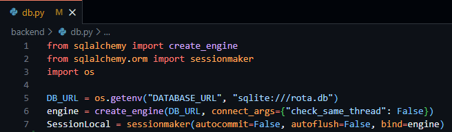

*Figure 14 - db.py file showing the creation of the database engine and local session of the database.*

This file enables the fundamental access to required database variables throughout the project through the simple importation of the `db.py` file.

As a result of the foundation of the database access having been created, I then moved on to the creation and design of the database tables required for Integrated Workforce Management Platform. These database tables, implemented through SQLAlchemy models follow the exact tables outlined in the external storage section above, following the same field names, validations and data types.

In starting to create these tables, I created a new file, models.py, enabling me to keep my database models separate from other parts of the code. To create the basis of this file prior to the creation of these tables/models I was required to import all the datatypes I would need (as outlined in the external storage section) and the base derivative class – both provided by SQLAlchemy. I then proceeded to create a variable called `Base` to easily access the declarative base class required to inform SQLAlchemy that my classes were to be converted to SQL tables, as seen below in Figure 15.

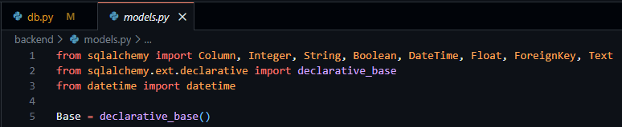

*Figure 15 - models.py file showing the importation of necessary data types and declarative base from SQLAlchemy.*

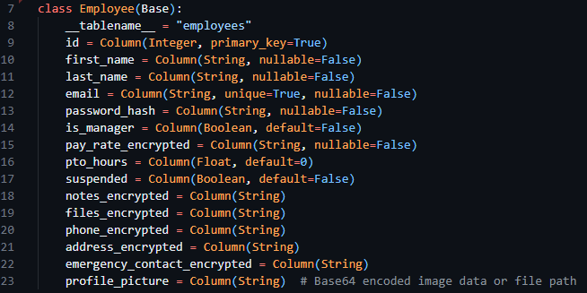

After this, I proceeded to convert the table designs from the external storage design section into SQLAlchemy compatible classes to be turned into database tables. The overall process consisted of the creation of a new child class with a descriptive title and the inclusion of the `Base` variable in the class declaration. Following this, in the body of the class a `__tablename__` variable was required to be set, indicating to SQLAlchemy the exact table name to set. Then finally, using the data classes provided by SQLAlchemy I was able to create new variables inside the class consisting of the field name (the variable declaration) and the datatype (as the variable definition) with any associated configuration options being available through the parameters of the datatype itself. I then went on to implement this for every table I outlined in the previous sections, below the Employee class can be seen in figure 16. 

*Figure 16 - The Employee model, from models.py file.*

I then imported the `SessionLocal` and all database models into my app.py file, enabling the database to initialise alongside the future code to be implemented in `app.py`.

#### Testing

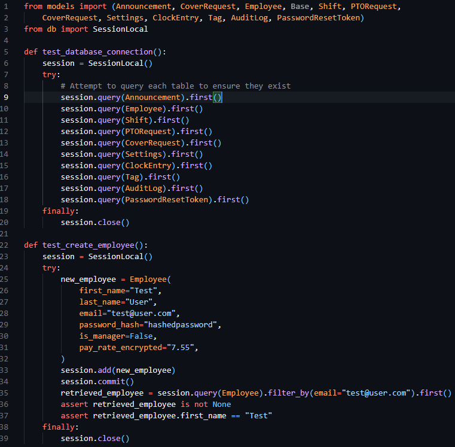

To test this iteration, I ran the `app.py` file verifying the creation of the database tables and checking to make sure they were composed as expected. Then proceeded to add some placeholder data into the table and verify that insertion and selection operations to the table occurred as expected. The code to test this implementation can be seen below in figure 17. 

*Figure 17 - app.py file containing tests to check the creation of the tables and the creation of mock data.*

### Iteration 2: M1, M15, M18 – Authentication: Login

This second iteration aims to fulfil the implementation of MUST requirement 1, through the implementation of secure login and session handling, enforcing authentication on routes and laying the groundwork for permission-based access in future iterations.

I started this iteration by laying the groundwork for the implementation of routes, as this was an essential prerequisite to authentication. As per previous technical research prototypes, I initialised the Sanic application in the app.py file, creating the Sanic application and enabling the running of the server through `app.run`. I then proceeded to make use of the `sanic_cors` library, which was included with the install of Sanic itself, allowing me to add `CORS` rules to the Sanic application. Following this, I then registered a Sanic blueprint, allowing me to define and contain my API routes in a file separate to app.py, increasing modularity and separation of concerns. This can be seen below in figure 18.

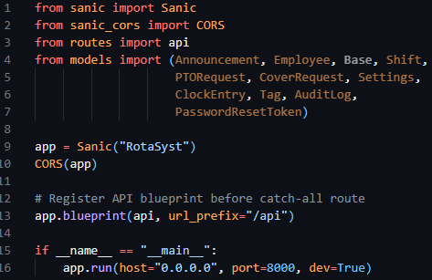

*Figure 18 - App.py file initialising the Sanic application, starting the server, configuring CORS and registering the routes blueprint.*

As a result of my implementation of the blueprint, a routes.py file had to be created, containing the base code to create said blueprint and enabling the import and reference to the blueprint called API in `app.py` to function correctly. This can be seen below in figure 19.

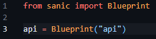

*Figure 19 - Creation and initilisation of the route blueprint in routes.py*

Now my initialisation of the Sanic app and creation of route handlers had been finalised, I moved on to creating helper functions and decorators to produce the desired requirements and aims previously outlined. 

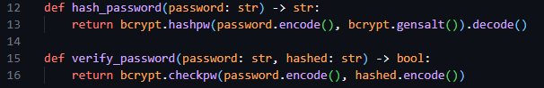

In keeping with my requirement of separation of concerns, I chose to separate the authentication management system from the routes themselves and created a new `auth.py` file and imported this in my `routes.py` file, enabling it for subsequent use in this prototype. In the `auth.py` file, I initially created two helper functions, `hash_password` and `verify_password`, enabling easy access to hash functionality. These functions made use of hashing algorithms provided by `bycrypt`, and through their implementation inside these functions bundled configuration options automatically – reducing the chances of issues arising of mismatched hash configurations. 

*Figure 20 - Snippet of the hashing helper functions previously mentioned.*

I then proceeded to create two further helper functions for use in this file that enable the encoding and decoding of session JWT tokens, `create_jwt` and `decode_jwt`. Allowing me to standardise the creation of my sessions. When creating these functions, I declared three constant variables to define the JWT secret (used to encode the data), the JWT algorithm (the type of encoding I required) and the session expiry – with 3600 seconds and HS256 being the respective session expiry time and encoding algorithm.

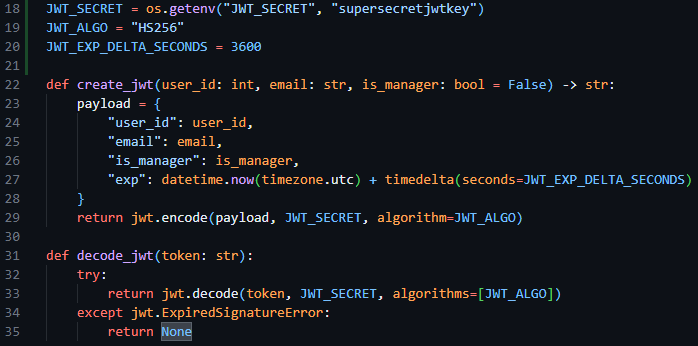

*Figure 21 - Snippet of code showing the JWT encoding and decoding algorithms and their constant variables.*

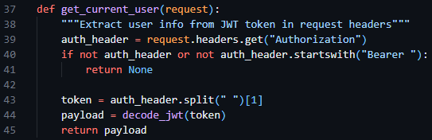

Following this, I then created a `get_current_user` helper function, enabling me to fetch the current user info from the request headers, making use of the `decode_jwt` function.

*Figure 22 - The `get_current_user` function in auth.py requesting the session token from the request headers and decoding it.*

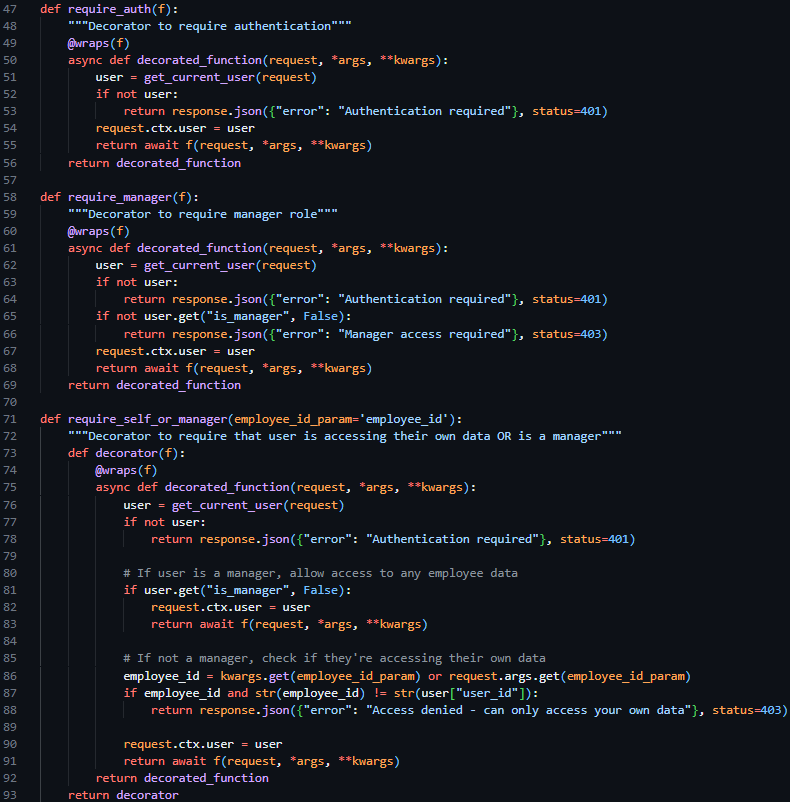

I then proceeded to create three decorator functions to be placed above route declarations in the route.py file, `@require_auth`, `@require_manager` and `@require_self_or_manager`. The first restricting access to the route if a valid session token is not included in the request, the second restricting access to the route if the user does not have managerial permissions, and the only allowing access to the route if the user is a manager or if the user if requesting their own data. These three decorator functions, which were able to be used in conjunction with each other, enable the easy restriction of HTTP routes per predefined cases – reducing the amount of repeated code needed.

After the creation of these base authentication features, I proceeded to the core implementation of a Login endpoint, which aimed to take in an email and password in the request body, verify the email and password against predefined security and data type standards and return either a success response and the JWT session token or a failure response.

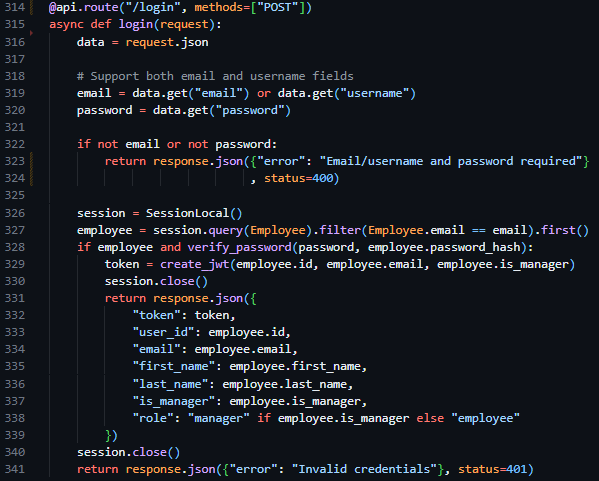

Therefore, to implement this route, I created a new route handler in routes.py (only accepting POST requests), initialising the route similarly to the way in which I had done in technical prototyping, but rather than be derived from the app class – derived from the api blueprint we defined previously. I began by converting the body of the request into JSON format, then verifying the presence of an email and password. Proceeding this I initiated an instance of the previously created database session, querying the users email against the Employee table, and returning Invalid Credentials if the query fails to return user data. Then, once the user is deemed to exist, and the provided password has been compared to the hash stored in the database using the verify_password function, I make use of the create_jwt function, close the database session and return the newly created session token and associated user data through a JSON response.

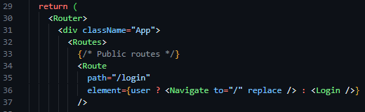

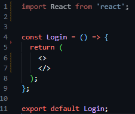

As a result of the completion of the backend routes required to facilitate authentication functionality, I then moved on to the implementation of the login page on the frontend side of the project. Aiming to follow the structure of the designs outlined in the screen design section, I initialised a new React project and installed react-router-dom, a library that builds on the capabilities of React, and Tailwind CSS, an easy-to-use wrapper over CSS – allowing for styles to be implemented inline with HTML tags. I then initiated the react router in the App.jsx file in the newly populated frontend directory (files auto populated by the react setup process), and defined my initial route ‘/login’, and linked it to a newly created Login component in the newly created pages directory. 

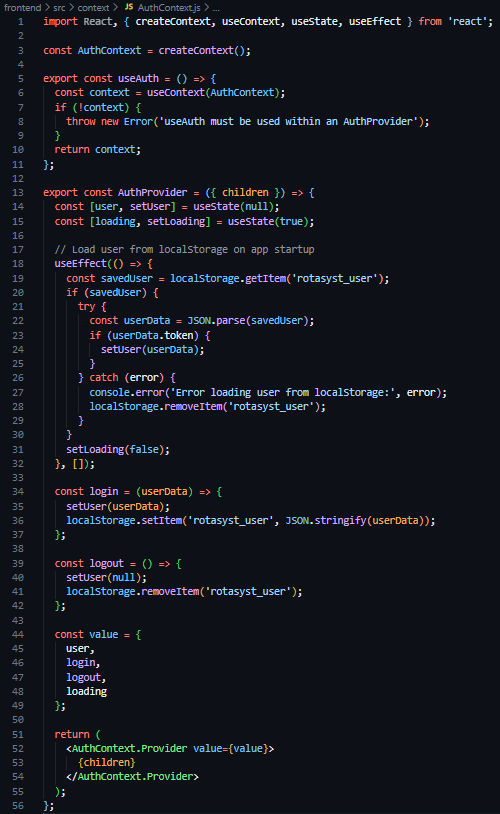

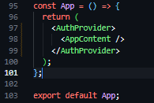

As a result of these frontend structural developments, I proceeded to then create a new directory in the frontend section of the project called context, containing a new file called AuthContext.js – a file to store, define and manage the authentication and state of users throughout the application. In this file I then defined a new constant of AuthContext, a derivative of the React provided createContext function, created and exported a useAuth function, and again created and exported a AuthProvider component. This AuthProvider component, which was wrapped around the element tree of the application (see Figure 27), loads the user from its session token saved in LocalStorage on page load, stores the state of the currently logged in user in useState hooks, and provides helper functions (login and logout) to facilitate the destruction and creation of LocalStorage values. 

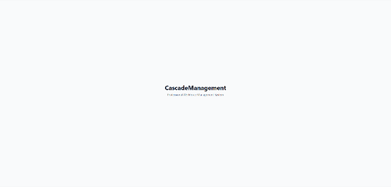

Moving back to the Login component (located at pages/Login.jsx), the next task was to implement the UI of the login page. I started by creating a creating an invisable box that flexed to the size of its contents with internal padding, then filled this with two horizontally centered items an h1 title stating ‘Integrated Workforce Management Platform’, and a p tagline stating ‘Professional Workforce Management System’.

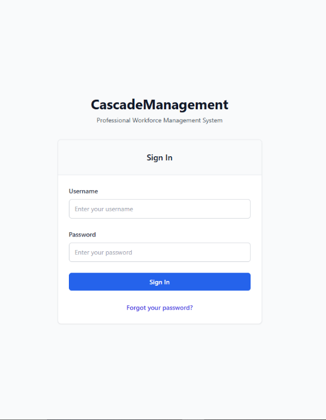

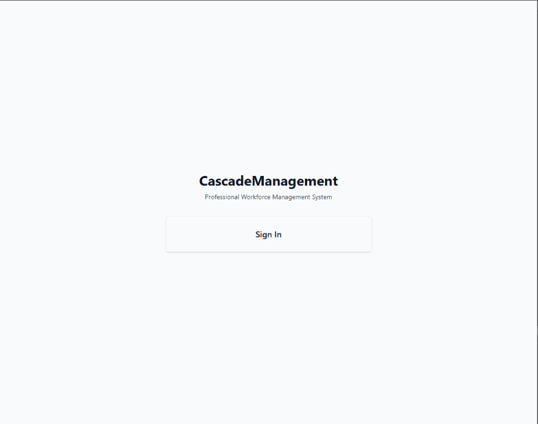

Following this, I then created a white card with outline shadow (see figure 30), with a title of ‘Sign In’ in large text. After this, I created the HTML form, and a placeholder function called handleSubmit in its onSubmit attribute, with a username text field and a password password field, both including a callback function handleChange in their onChange attributes. Below these, I added a blue button with the text ’Login’ and a blue ‘Forgot Your Password’ hyperlink.  You can see these changes aside in figure 31.

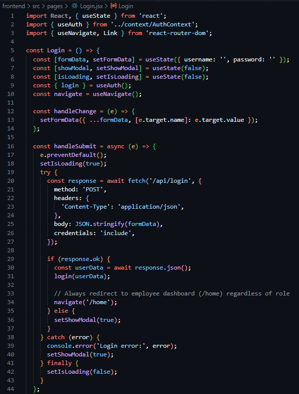

Following this completion of the implementation of the UI design, the functionality behind the page was required to be implemented. Beginning with the creation of these event related functions, I created a handle data change function that stores the new field data in a useState hook called formData in a key value pair – with the field name as the key and the new content as the value. This allowed me to have stored copies of the field data to use when creating the handleSubmit function, which after preventing the default action of HTML forms, set a loading state (indicating to the button content to convert to an animated spinner) and dispatch an asyncronous POST request using the native JavaScript fetch API to the ‘/api/login’ backend endpoint I recently created, populating the body with a string version of the key-value store that is formData. Following this, I added an if clause, checking if the response was successful, in which case it would make use of the previously created useAuth custom hook and save the provided data to global state via the login function assosiated with it, then subsequently perform a redirect to ‘/home’. And in the case of an error arrising, a modal would be revealed, stating ‘Invalid username or password. Please check your credentials and try again.’ In large text with a blue button below with the text ‘Try Again’.

#### Testing

To test this iteration I created various situations in which I could predict the excpected functionality of the system and record the outcome. 

Firstly, I provided the login page with the credentials that were present in the Employee database. I excepted a successful request presenting the HTTP status code of 200, the recieval of the data assosiated with the user, the recieval of a session JWT token and a UI redirection to `‘/home’.` The Figures below (33 & 34) capture both the network response and resultant data provided by the API, proving the system to function as intended.

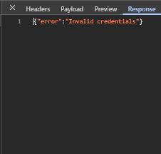

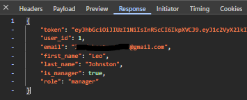

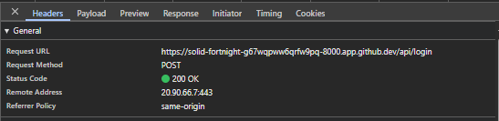

Following this, the next test I shall produce will input invalid credentials into the login page, spesifically an incorrect password in the password field. This should produce a 401 error in the network tab with the response stating ‘Invalid Credentials’, and the UI should reveal an error modal. The three figures below (35, 36 & 37) show evidence of the network response, response body and UI response – showcasing the system functions as intended.


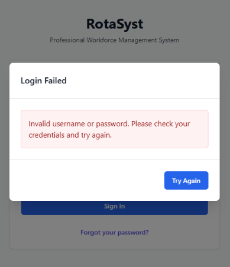

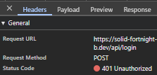

For the final test, I shall create a mockup protected route making use of the @require_manager decorator I previously created. This route shall be tested in three ways, when lacking a token, when possessing only an employee token and when possessing a manager token. The expected behaviour is as follows: when lacking a session token, the route should respond with a 401 status code, when possessing a session token without managerial permissions the route should respond with a 403 status code and finally when possessing a session token with managerial permissions the route should respond with a 200 status code.  The three figures below, (38, 39 & 40) show evidence of these network responses for the various situations and directly prove the system functioning as intended during development. 


Iteration 3: M1, M19, M15, M18 – Authentication: Password Reset

The goal of this iteration is to build upon the previously started authentication system by building the functionality behind the ‘Forgotten your password?’ button on the Login screen. Delivering secure password reset functionality through expiring one time token-based links sent to the provided email address.

Due to the `ResetPasswordToken` model and table already existing due to implementation in the initial iteration, the initial focus of this iteration was to create the routes required for this functionality to be accessible. I identified 3 main routes needed to implement this functionality: `‘/password-reset/request’`, `‘/reset-password/<token>’`, and `‘/password-reset/confirm/<token>’`.

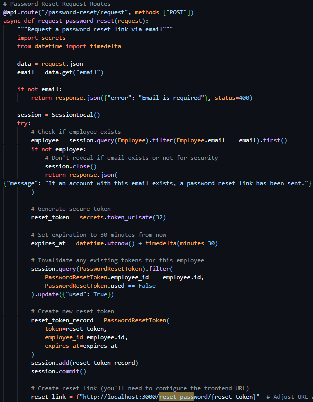

The first route (see Figure 41), a POST route in the routes.py file, requiring an email address in the body, initially queries the database Employees table to verify the existence of a user with the provided email address. If no user is found, the exact same success response is returned as if the action had successfully occurred – preventing hackers from identifying users through this medium. Once the validity of the user has been confirmed, I moved on to generating a secure and unique reset token – while there were many methods for this (including reusing existing JWT code for this purpose) – I wanted the assurance of a URL-safe token, and therefore chose to use the built-in Python library secrets and their token_urlsafe function, which allowed me to be assured that the token that was produced was compatible with my use case and to select the amount of bytes of the token itself. I then proceeded to invalidate any existing password reset tokens associated with the user through a filtered update query of the PasswordResetTokens, then subsequently created a new reset token record with the newly generated token, employee id and expiry time (the current time plus 30 minutes).

Following this I was required to present the token reset link to the user, through an email – and as a result decided to create a helper function to dispatch emails uniformly across the project making use of the SMTP credentials provided by the configurable settings system table.

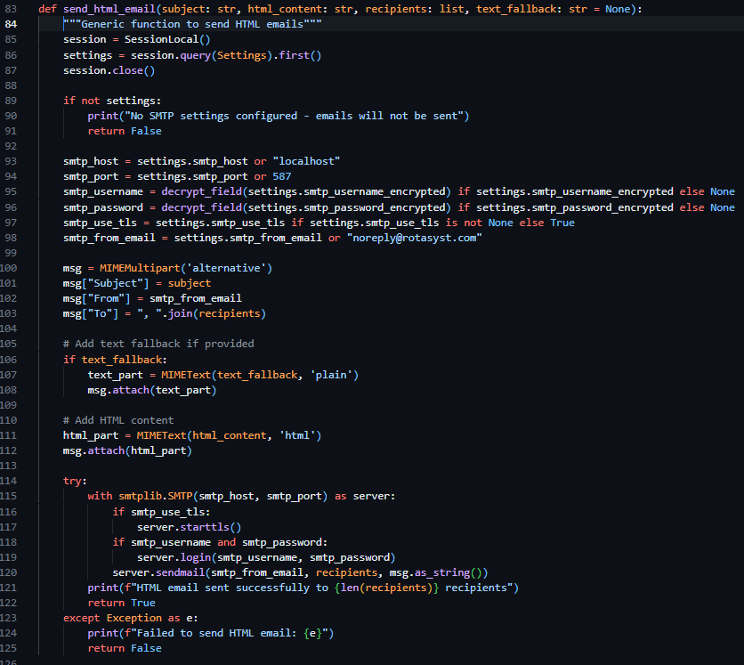

In the same file, I created a new helper function called `send_html_email`, which utilizes the built in `email` library in Python, specifically `email.mime.multipart.MIMEMultipart`, which enabled me – after I queried the Settings table for SMTP settings and printed a console error if these values were unset – to directly form the email from the provided parameters `(subject, html_content, recipients, text_fallback)` and dispatch the email according to the settings saved in the `Settings` table of the database.

Due to this function lacking the functionality to directly generate email content, I was required to store and generate these emails myself – and as a result I created a new file called email_templates.py and created a function called create_password_reset_request_email, requiring employee name, reset link and expires in as parameters. I then proceeded to create the body of this email using pure HTML and CCS then placed my code into https://jam.dev/utilities/css-inliner-for-email, a tool to convert typical HTML and CCS into compatible email versions. I then placed the newly in lined HTML content into the return statement of the function and used f-strings to place my function parameters in the string itself.

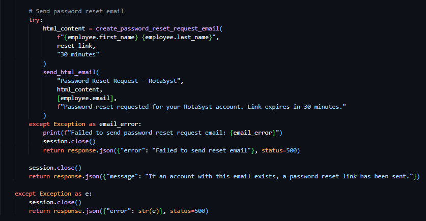

As a result of both helper functions being completed, I continued with the development of the password reset request route. I proceeded to make use of the send_html_email function and included the text "Password Reset Request - RotaSyst" as the email subject, the employee email as the recipient email address and the text "Password reset requested for your RotaSyst account. Link expires in 30 minutes." As the fallback text. I then created a variable called html_content and associated it with the invocation of the create_password_reset_request_email function, with the associated appropriate parameters. I then moved on to the sending of a success 200 response – with the message “If an account with this email exists, a password reset link has been sent”. When deploying the email to send the user the reset password URL, my first implementation failed my test dispatch – this was due to the SMTP settings not being configured in the database, I then proceeded to realise that this error was not conveyed to the user in any way so I modified the email delivery code and placed it in a try clause – tasked to catch all exceptions occurring during the building of the email body and its dispatch. I then placed an error response below the except portion of the try clause – enabling communication with the user about the email delivery failure (as seen in Figure 43). 

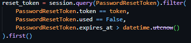

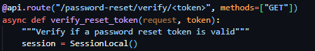

With the successful implementation of this route, I continued to the implementation of the token verification route – a route that should accept GET requests with the token as a part of its URL to check its validity prior to password reset submission. I proceeded to initialise this route through the same method as previous routes but included <token> in the URL – allowing me to access the URL content provided in this spot in the route handler, a method previously covered by the technical prototyping. I then proceeded to dispatch a filtered query to PasswordResetToken table, with the token provided as the search term and the conditions of PasswordResetToken.used being False and PasswordResetToken.expires_at being bigger than the current datetime object (see Figure 45). If this query returns nothing, an error response will be sent to the client detailing the error (“Invalid or expired token”).

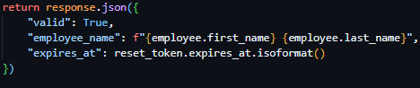


Proceeding this, the route then queries the Employee table, gathering further information on the employee via the employee ID provided by the reset tokens payload. And subsequently returns a successful JSON response containing a validity key, employee name key and a expiry time key. 

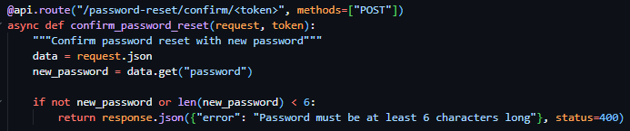

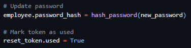


Following this, I moved on to the creation of the password reset confirmation route which required the inclusion of the reset token in the URL parameters once again. As well as the reset token, this route required the inclusion of the body parameter new password, which I validated to be present and to be over 6 characters (see figure 47). I then subsequently used the same method as the previously developed route to verify the tokens validity and presence and to gather the data associated with the user ID provided by the tokens payload and responded with the same error messages on the failure of these checks. I then proceeded to immediately hash the password provided by the request body and update it in the Employee table record associated with the user and marked the token as used (see figure 48). I then ended the request with a successful JSON response as seen in Figure 49. 

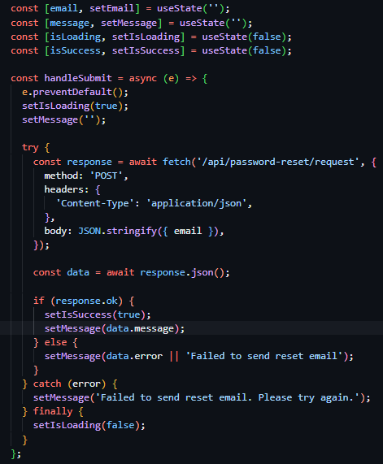

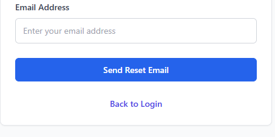

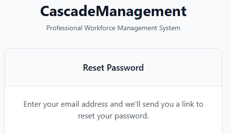

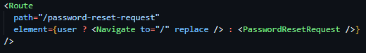

As the backend routes were now completed, I started work on the frontend implementations of this feature set. I started with the creation of PasswordResetRequest.jsx, a file located in the Pages directory alongside the Login.jsx file, linked to the route declaration ‘/password-reset-request’ (see figure 50). Once this declaration of the route path was complete, I started building the frontend UI for the password reset page. The UI, which was initially copied from the Login.jsx page for continuity and design consistency reasons, is directly like the Login page, boasting a title and tagline centred above a white box with shadowed boarders containing a form. The differing factor between this UI and that of the Login page was the title of the box and the inclusion of instructional text at the beginning of the boxes content area (see Figure 51). I then proceeded to modify the form, removing the password field from the form, changing the display text of the button to ‘Send Reset Email’, and replacing the hyperlink at the bottom of the page with a hyperlink enabling navigation to return to the login page. 


With the main body of the page to request a password reset designed and implemented, I then moved on to the implementation of the JavaScript Logic behind the forms action. In the same way as the Login page, the field data is set on update to a useState hook for constant storage and the form itself is linked to the handleSubmit function through the onSubmit event. For the most part the dispatch of the request to the backend is done in the same way as the Login page, with the exception of the inclusion of the new hooks isSuccess and message – storing the success state and rendering a conditional UI if false, and storing the error message provided by the backend.

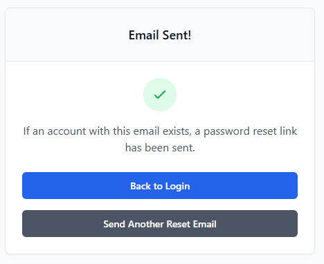

I then designed and implemented a conditional UI to be rendered if the isSuccess hook has a boolean value of true. The UI maintained the structure of the original password reset page, but with the replacement of ‘Reset Password’ as the card title with ‘Email Sent!’, the inclusion of a green checkmark above the original placement of the text, the instructional text being changed to the contents of the message state, the removal of the input box and label, the replacement of the text in the blue button to ‘Back to Login’ and the inclusion of a secondary grey button with the text ‘Send Another Reset Email’ linking the user back to the Reset Password Request Page through its changing of the success state. 

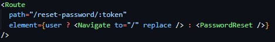

Due to the completion of the password reset request page, I moved on to the creation of the password reset page itself (PasswordReset.jsx), a page only accessible via the inclusion of a token in its URL, facilitated through the inclusion of a URL parameter in the route declaration in the App.jsx file (see Figure 56). 

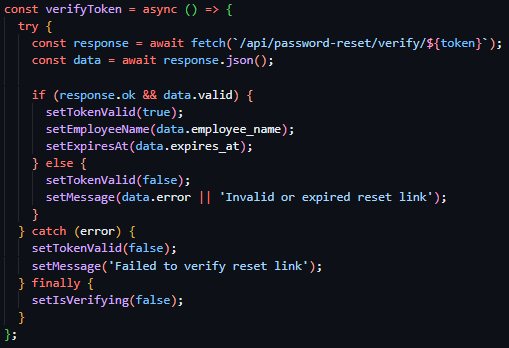

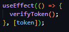

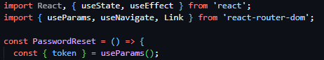

I then created the component and fetched the token from the URL using the native React Router Dom hook useParams. Following this I created a verifyToken function to be ran on page load or on the event of the token being changed through its calling in a useEffect hook (see Figure 58). This function deploys an HTTP GET request to the ‘/password-reset/verify/<token>’, route with the token from the URL as a URL parameter – to check the validity of the token. On request response, if it is successful sets the tokenValid state as true, populates the employeeName state and expiresAt hook with the data returned and sets isVerifying to false. If the request responds with an error, the tokenValid state is subsequently set to false, and the message state is populated with the response error message.

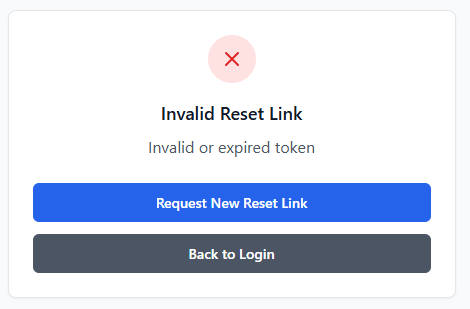

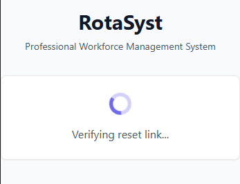

I then created three conditionally rendered UIs, with all based on the same UI structure as the previous Login and password reset assosiated pages. The first, rendered if the isVerifying state is true is a direct copy of the Email Sent UI, without the inclusion of the two buttons or the header text, with the tick icon replaced with a spinning loading icon and the instructional text stating ‘verifying reset link…’.

The second conditionally rendered page, being shown only if the `tokenValid` state is set to false, is an almost direct copy of the password reset request success page conditional view, the only changes being the tick changing to a red cross, the header text changing to ‘Invalid Reset Link’, the informational text changing to ‘Invalid or expired token’ and the top blue button text changing to say ‘Request New Reset Link’ and linking to the reset password request page.


The final conditionally renderered state, shown only if the success state is true, is a terciary direct copy of the password reset request success conditional view, the differing factors being the header text stating ‘Password Reset Successful!’, the replacement of the instructional text to the request response message using the message state, the secondary line of text stating that ‘You will be redirected to the login page in a few seconds...’ and the inclusion of a singular blue button linking to the login page with the text ‘Go to Login Now’. 

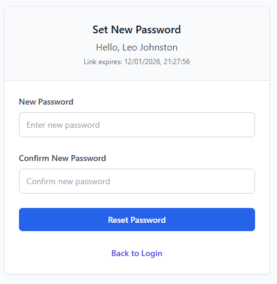

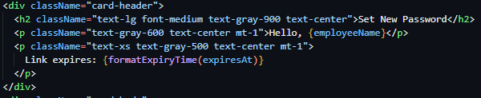

As a result of the conditional states being implemented, the main page UI was my next task. I again borrowed the UI and form composition from the Login.jsx page, changing minimal details. One such detail being the box header being set to ‘Set New Password’ and the inclusion of two more lines of text with subsequent size decreases – the first stating ‘Hello, ‘ then the name of the logged in user from the employeeName state and the second stating ‘Link expires: ‘ then the expiresAt state normalised through the formatExpiryTime function I created to convert from isoString to human readable string. The final two changes to the original copied UI was the addition of two labeled input fields - the first stating new password and the second to confirm the new password, both writing their contents onChange to the password and confirmPassword states – and the changing of the blue button content to ‘Reset Password’. 

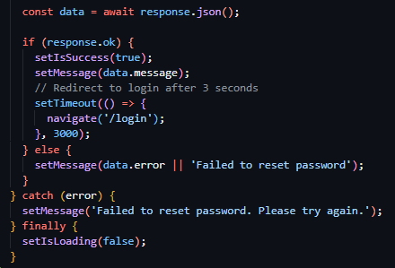

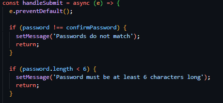

With the completion of the UIs, I started work on the functionality behind the submission of the set new password form. I created the function handleSubmit (which was linked to the onSubmit attribute of the form tag) and prevented the default functionality of HTML forms – allowing me to have increased customization. I started with field verification, and compared both the confirmPassword and password states against eachother, and with that succeeding checked the length of the password to be above 6 characters long. I then proceeded to deploy a POST request using the JavaScript native fetch API to the ‘/password-reset/confirm/<token>’ endpoint – filling the token value with the token fetched from the current URL path – and including the password states value in the request body. I then checked for request success and if true I set isSuccess to true, populated the message state with the response message and set a redirect to ‘/login’ after 3 seconds. If the request failed, I populated the message state with the request response body. Then for both situations, I set isLoading to false.

#### Testing

Due to all the prior outlines of the iteration being met I moved on to testing of the iteration. Due to the many features being implemented in this iteration, many tests are subsequently rewuires to assure full adherance to expected functionality. 

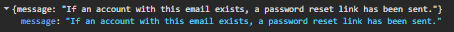

The first test taken to assure functionality was in relation to reset password initial requests, in which I tested the dispatch of a reset password request with an email assosiated with an existing account and one with an email linked to no exisiting account. I expect both tests to return the same response, both returning a 200 status code and the same generic response message. Figures 66 and 67 show the response body and status code returned when a request is sent with a valid email address and Figures 68 and 69 show the response body and status code returned in the case of a request being sent with an invalid, unregistered email address.


The second test I will be conducting will be in relation to the endpoint that checks the validility of password reset tokens, checking that the expected functionality occurs under all circumstances. I will be including both a valid token and invalid token in the URL of the frontend /reset-password/<token> page, with a valid token showing both a HTTP status code of 200 in the network tab and the correct conditional UI and an invalid token showing a 400 HTTP status code response in the network tab and the ‘Invalid Reset Link’ conditional UI. The four figures below (Figures 70, 71, 72 & 73) capture these responses and showcase that the expected functionality is occuring.


### Iteration 4: M3, M15 – Employee Management: Creation, Deactivation, Listing & Modification

Iteration four focused on the implementation of employee management functionality, primarily giving management users the API routes and UI to enable account creation, viewing, modification, suspension and deletion. This was a core system requirement, as a result of all secondary iterations being directly dependent on accurate employee data and management – such as scheduling, payroll and time-tracking.

This iteration specifically built directly on top of existing authentication, authorization, encryption and database mechanisms created in the prior three iterations. One such example of this was the implementation of these management API routes being protected through previously developed access control decorators built in Iteration 2 – ensuring that users with both a valid session and managerial permissions could access said routes, while restricting access and providing a standardised error response to unauthorised users and those without sufficient permissions.

Further evidence of this iteration directly building upon previous implementations was the use of sensitive employee data throughout this iterations implementation and its subsequent fetching from the database models and management system created in Iteration 1. This use of the previously standardised database models ensures encryption standards were followed and data retrieval and storage remained consistent throughout the application.

When developing the backend, I primarily focused on the implementation of various simplistic CRUD (Create, Read, Update, Delete) routes, such as `POST` & `GET` `‘/employees’` to respectively create and fetch employees, `GET` & `PUT` `‘/employees/<id>’` to fetch one singular employee using their ID and to update the data associated with one specific employee, and `POST` `‘/employees/<id>/suspend’` to suspend an employee using their ID.


These various CRUD routes, allowing for differing operational actions to be taken against a user, made use of previously outlined methods of implementation – using the @require_manager decorator on the route declaration enabling the enforcement of access only to authenticated users with managerial permissions (see figure 74), previously discussed hashing helper functions, and basic database queries and operations.


In the case of the frontend, a wide range of components was required to be created, including a new managerial dashboard page – in a React route protected by user characteristics. I implemented this using JSX logic inline in the element declaration. I then proceeded to create a separate management only accessible router system, located in the ManagementDashboard.jsx file in the pages directory, allowing this permission check of the endpoint shown in Figure 75 to cover all future management endpoints. I then created a comprehensive sidebar UI in this component (see figure 76), due to stakeholder feedback in the screen design section advising me that the continuation of the navigation bar from the employee dashboard designs had become too cluttered, and implemented React Router Dom sub navigation features to insert the correct page content in the content area of the management navigation component (see figure 77). Duyring the creation of the navigation bar, I significantly struggled  in making sure page content did not render under the sidebar itself, an issue I solved by adding padding to the content rendering area as seen in Figure 77.


Following the implementation of the sidebar and management navigation configuration, I then implemented the logic and UI enabling the functionality of the previously developer CRUD endpoints to function in the application. To build these I utilised existing form-handing, request dispatching, modal (popup) systems, and validation patterns to ensure a consistent user experience (see Figure 78), with the only major new UI implementation being the creation of a new employee listing ‘table’ which followed the same UI implementation of the Login box, with a differing aspect ratio – stretched to fit the screen rather than flexed to fit the inner content.

#### Testing

Testing for this iteration focused on the verification of employee management functionality, both the UI and backend, operate correctly, securely and in accordance with the predefined aims and requirements for the system. As a result of this system being a base for future iterations to build upon, both functional and access-based testing was required. 

To test the implementation of access control, API endpoints such as `GET /employees` and `PUT /employees/<id>` were accessed using both managerial and non-managerial accounts, which produced the expected outcome – a test that was done more in detail in iteration 2.


The functionality of CRUD endpoints themselves were then subsequently tested by creating a new employee record and verifying its presence in the UI employee list, updating specific fields related to that employee and confirming the persistence of the changes after a page refresh (a valid manner in which to test the presence of the newly created information in the database due to the frontend and backend lacking a cache system). The suspension route (POST /employees/<id>/suspend) was tested by suspending an employee account and verifying that the account was unable to authenticate or access protected routes thereafter.


As mentioned previously, one issue identified during testing of the UI implementation involved the page content of the management dashboard rendering beneath the sidebar navigation – significantly reducing the useability of the application (see Figure 79). This issue was easily resolved through the inclusion of size-conditional padding and margins within the content rendering area, and subsequent testing confirmed the correct rendering occurring across the management dashboard post-fix (see Figure 80). 

### Iteration 5: M11, M15 – Announcements

With the base of the management dashboard created iteration five focused on the development of a core employee and management system, the internal announcement system, allowing management users to publish time-sensitive information to employees in a clear, structured manner. This functionality directly appeases the previously outlined requirement of effective internal communication, ensuring urgent and general announcements could be distributed consistently across the platform. 

This iteration, once again, built directly upon the previously developed core features such as authentication and permission-based access control. In particular, through the use of the previously developed authorisation decorators, the CRUD routes to manage the deployment of announcements were locked to users with managerial permissions and the announcement viewing router were locked to any authenticated user. This reuse of existing access control logic ensured consistency throughout the application through the standardisation of failure responses and reduced the duplication of security focused code. 


My attention first focused on the backend. Due to the previously implemented Announcements database model, created in Iteration 1, there was minor programmatic implementations to be made, namely the implementation of four routes. PUT ‘/announcements/<ann_id>’, DELETE ‘/announcements/<ann_id>’, POST ‘/announcements’ and GET ‘/announcements’. These routes performed CRUD actions to specific and all announcements, the first modifying an existing announcement according to the provided ID, the second deleting an existing announcement according to the provided ID, the third creating an announcement and the fourth fetching a list of all active announcements and their associated data. Due to the nature of the announcements system needing to be viewable by all users but the creation, updating and deletion of announcements needing to be locked to managerial users only – the first three endpoints made use of the @require_manager decorator while the last endpoint (fetching all active announcements) made use of the @require_auth decorator. 


These routes all utilised previously outlined methods in their implementations, with all routes (other than POST ‘/announcements’) being wrappers for database actions. The implementation of the announcement creation route specifically had more technical detail associated with it, requiring the deployment of many emails if required by the submitting user. This was achieved through using the send_html_email function, with the email body being a direct copy of the previously designed email template with text modifications to make it suitable for use in announcement notification. Rather than the creation of a dedicated new email template, the direct copy of the reset password email was used to assure continuity and brand identity between the various emails deployed by the system. 


Therefore, with the creation of the backend CRUD routes being complete, I started work on the frontend – initially aiming to create an employee announcements page. Prior to this task being started, I realised the lack of an employee dashboard and navigation system being implemented and turned to my screen designs to implement said component. Due to my prior implementation of a page routing system, I was quickly able to implement 3 employee dashboard placeholder pages (Dashboard, Announcements & Profile) to use in subsequent iterations (see Figure 84), created placeholder components to link to said routes for the time being, and implemented conditional rendering of the UI dependent on the presence of a user object in the aforementioned global user state. 

*Figure 85 - Completed navigation bar for employee dashboard.*


Following this I then converted my navigation bar design from the screen design section and implemented it in all three newly created placeholder components, highlighting the appropriate navigation item depending on the page the user was currently on (see Figure 85) and conditionally rendered a fourth highlighted navigation item if the user had managerial permissions, enabling navigation to the newly created management dashboard (see Figure 86).


With the completion of the navigation system for the employee dashboard, my attention moved back to the implementation of the employee dashboard announcements page. To begin, below the navigation bar, I created a header element to indicate the user of the page they were currently on, a direct replica of the screen design of the announcements page – with an icon at the top, title in bold text and a tagline below. I then created the conditionally rendered announcement boxes, building on the box design created in Iteration 1 for the Authentication screens. The differing factor in these boxes’ implementation was their width, which were stretched to the length of the container (like Iteration 4) rather than flexed to fit the content of the box itself. Following the screen design, I then implemented the title and content of these boxes and included a smaller element attached to the bottom of the box, stating the posting time and day. Due to the completion of the announcement box design, I mapped this announcement box design to a list of all current announcements – fetched in the same manner as previous requests – through the previously implemented ‘/announcements’ GET route.


Each announcement block displayed a title, an urgency indicator, descriptive text, and metadata showing the date and time the announcement was posted. Urgency indicators were implemented using colour-coded labels (green, amber, or red), with the urgent state rendered in red and clearly marked using uppercase text to draw immediate user attention (see Figure 91). This design choice was informed by stakeholder feedback, which emphasised the need for urgent announcements to be visually distinct from routine information.


Due to the employee view announcements page being complete, I then moved on to the creation of the management dashboard page to deploy, modify and delete announcements. This page was implemented using existing standards – reusing the employee view table to list all announcements and reusing previously implemented form designs to capture the creation and submission data used in the respective requests.

Where appropriate, existing UI systems such as reusable content blocks and layout containers were reused to reduce unnecessary duplication and maintain consistency across the application. This approach ensured that the announcements system integrated seamlessly with the broader dashboard environment without introducing conflicting visual or interaction patterns.

#### Testing

The testing of this iteration focused again on the validation of functionality and access control of the announcement system. Due to the announcements system being the sole form of audited communication provided by the platform, a focus on the correct data being displayed and access controls was essential to assuring full functionality of the communication system.

Access control testing for this specific implementation was limited in its scope, due to its use of previously tested access control mechanisms (the decorators created in Iteration 2). When accessed by a standard employee account, protected endpoints such as `POST /announcements` correctly returned an unauthorised response, while managerial accounts were able to create and update announcements successfully, confirming correct permission enforcement.

When testing the functionality of the announcement system, I created various announcements with various differing attributes – email dispatch, urgency and content being the main focuses – and verified these tasks were carried out correctly. In the case of the email dispatch, this was successful in its implementation due to previous testing carried out in Iteration 3 solidifying this, regarding the urgency indicators – the appropriate chosen coloured indicators were displayed according to the level chosen at announcement creation. Page refreshes were also administered to confirm the persistence of data in the database 


UI testing revealed an early layout issue in which announcement boxed lacked visual separation between each other. This issue was once again solved by adjusting the margins of the boxes themselves and was a minor fix. 

Overall, testing confirmed that the announcements system met its intended requirements and integrated effectively with the existing authentication, authorisation, and dashboard infrastructure, providing a reliable foundation for future enhancements. 

### Iteration 6: M4, M15 – Shift Management: Creation (Basic & Bulk), Update, Deletion & Listing

Iteration six focused on the development of shift scheduling functionality – enabling the creation modification, deletion and viewing of shifts. This iteration was a major implementation of core system functionality – as the shift management system was a core requirement for the system and fundamental to the employee-facing dashboards, management oversight and the data it collects being essential to features developed in later iterations such as time tracking and payroll management.

This iteration built directly upon employee management systems created in Iteration 4, relying directly on the existence of employee records, account states, and permission data to ensure shifts could only be assigned to valid and active employees. Additionally, the prior developed authentication and authorisation mechanisms were utilised to restrict shift creation, modification and deletion to management users only, while enabling standard employees to view shifts. 


I initiated development focusing on the backend – prioritising the creation of a comprehensive set of RESTful CRUD API routes to manage shift data. I started with the implementation of POST ‘/shifts’, a route to facilitate the creation of a shift by a managerial user, which was locked to managerial users through the @require_manager decorator and presented the option to ‘Bulk’ create shifts through the is_bulk flag in the request body, the bulk_end_date request body value and recurring_pattern request body value, which allowed a programmatical loop to create multiple shifts from these values (see Figure 96). With the bulk creation loop implemented, I then facilitated the creation of a singular shift through the gathering of the employee data of which the shift creation request was assigned to and the start and end time of the shift, sumsequently creating the shift using a database query in the same way as previous implementations (see Figure 97) and then used this shift creation code for both singular shift creation and bulk shift creation. The final item of implementation for full functionality of this route was the inclusion of email notification dispatch if the send_notification request body flag was included by the requesting user – which was implemented using previously defined functions and email templates such as send_html_email. With the shift creation endpoint completed, the remaining shift CRUD routes (PUT ‘/shifts/<shift_id>’, DELETE ‘/shifts/<shift_id>’ and GET ‘/shifts’) were implemented using previously expendad upon database querying methods and responses due to their nature as being mostly wrappers to display and action data contained in the database. All routes were locked to managerial users through the @require_manager decorator, excluding GET ‘/shifts’ which made use of the @require_auth decorator.


When implementing the frontend, my attention initially was focused on the creation of the employee home dashboard page which I previously created the structure for. I implemented four statistic boxes as per the screen designs containing hours worked this month and week and money earnt this month and week – all four currently displaying placeholder data to be implemented subsequent iterations. 

*Figure 99 - Statistic boxes on the employee dashboard home page*


I then proceeded to work on a shift calendar component, to be placed directly below the statistic boxes, and built this upon existing implementations of box elements – the differing factor being the calendar box stretching to the width of the page. I then added a title, tagline and view dropdown box at the top of the box header, informing the user of the functionality of the section and enabling the user to view a monthly overview of all shifts if desired. Below this I then implemented two arrow buttons and a centered week beginning and week ending title, allowing the user to cycle between differing weeks or months and view the currently selected week/month. 


When building the content of the box, I dynamically rendered a table in differing sizes as per the status of the viewMode state – enabling the content of the box to change alongside the differing views (weekly or monthly). With the top of the box being expanded to hold every day of the week in monthly view and the table being completely transformed in weekly view – with every individual employee down the side and the week dates along the top. 

As a result of the basic weekly and monthly calender view being complete, I implemented the data gathering through the previously implemented `GET ‘/shifts’` route through request methods previously covered and populated the contents of each table column and row with the presence of the shift. 


With the implementation of the employee view my focus shifted to the creation of a corresponding management-facing scheduling page within the management dashboard navigation system created in Iteration 4. This page reused the same calendar component to ensure consistency between employee and management views, while extending functionality to include shift creation, modification, and deletion controls. A “Create Shift” action was added to this page, opening a modal-based form that allowed managers to assign shifts to employees using existing form-handling and validation systems (see Figure 102). Bulk shift creation functionality was also exposed through this interface, enabling efficient scheduling of recurring shifts. 

*Figure 102 - Create new shift form, reusing form components previously created.*

Stakeholder feedback from earlier design stages highlighted the importance of consistency between employee and management scheduling views. As a result, the same calendar layout and interaction patterns were reused across both pages, reducing the learning curve for users switching between views.

#### Testing

Due to the access control system being previously tested, these tests were omitted from this iteration. I then focused on functional testing, involving the creation of both individual and bulk shifts and verifying their appearance within the calendar interface on both the employee dashboard and management scheduling pages. The ability to switch between weekly and monthly calendar views, as well as navigate between time periods using increment controls, was tested and confirmed to function as expected. Changes to shifts, including updates and deletions, were reflected immediately within the calendar following page refreshes, confirming correct data persistence and retrieval.

Overall, testing confirmed that the shift scheduling system met its intended requirements, integrated effectively with existing employee and management systems, and provided a robust foundation for subsequent time-tracking and payroll-related functionality.

### Iteration 7: M10, M15 – Tag System

The next iteration, iteration seven, focused on the implementation of a flexible tag system, allowing management users to categorise and colour code shifts at creation at update. This functionality was introduced to support improved shift identification and to build the underlying system behind the cover request and PTO request systems to be built in subsequent iterations. 

Building upon existing functionality covered by previous iterations such as authentication and authorisation mechanisms, the tag system management was ensured to only be accessible by managerial users - with standard employee accounts restricted to read only access. 


When developing this iteration, I initially focused on the backend, creating four CRUD endpoints interacting with the previously defined and implemented Tag database table/model from Iteration 1. I precedingly created 3 managerial locked endpoints, implemented through the use of the @require_manager decorator (POST ‘/tags’, PUT ‘/tags/<tag_id>’, and DELETE ‘/tags/<tag_id>’) to respectively manage the creation, modification and deletion of tags. I then implemented a fourth GET ‘/tags’ endpoint, protected by the @require_auth decorator, ensuring access to view all active tags was locked to authenticated users. These CRUD routes, excluding the addition of validation as previously implemented, were implemented as wrappers for data interactions – through the taking of actions previously outlined in other Iterations.

Each tag was designed to be an individual database entry, with each shift able to be linked to an existing tag entity. As a result, one tag could have many relationships with differing shift data objects – allowing for easy identification of a purpose of a shift.


Due to the creation of the CRUD routes being complete, frontend UI development work commenced, and I built upon the existing system in place for management dashboard navigation and started to populate the tag management page which up to this point held no content other than navigation. I took advantage of existing form-handling logic, modal logic, validation systems and UI components to create the tag page – ensuring that the UI remained consistent with the rest of the projects modules and pages. 


I copied the shift creation page template and replaced the create shift button with a create tag button which resulted in the opining of a form modal to create a tag. This form, based upon the existing forms throughout the project, took in a tag name and tag colour hex code (which I improved upon due to stakeholder feedback by adding a colour picker, and deployed a request containing the form body to the POST ‘/tags’ endpoint. Below this, I reused the standard content box expanded upon throughout the iterative development cycle and created mini content boxes containing the colour of the tag, the tag title, an edit button and a delete button (see Figure 105) – on the event of the edit button being clicked, a second modal is revealed, identical to that of the create new tag modal the differing factor being its title and tag values being prefilled in the input fields (see Figure 106).

While the introduction and development of this tag system provides little to no visible employee functionality – its role in identifying shifts immediately enables quick and easy checking of shift types. Through its implementation, subsequent systems such as cover requests and PTO management were able to leverage tags for use cases such as programmatic identification and classification.

#### Testing

Testing for this iteration specifically focused on the verification of the expandability of this system and its security and correctness, as it was created to primarily support the implementation of later iterations.

I firstly conducted access control testing, attempting to access create, update and delete tag routes with and without managerial permissions. Protected routes such as `POST ‘/tags’` and `DELETE ‘/tags/<id>’` correctly returned unauthorised responses when accessed by non-managerial users, while managerial accounts were able to perform all tag management actions successfully.

Moving on to testing the functionality of the UI and the subsequent associated actions, I created multiple tags, updated their values and deleted several tags – whose changes all were reflected in the UI and persisted after page refreshes and local cache clearances.

Additional testing I performed, namely the checking of the ability to access and modify the tag system throughout the backend codebase, verified that tags could be manipulated and created throughout the system – ensuring compatibility with future iterations.

Overall, testing confirmed that the tag system was working as expected and all functionality was producing the correct results – meeting the intended requirements of the system as a whole. 

### Iteration 8: M5, M15 – Cover Requests: API, UI & Approvals/Rejection

The focus of iteration eight was the implementation of a cover request system, allowing employees to request cover from their peers for their assigned shifts, and receive either an acceptance or rejection – resulting in a shift reassignment in the case of acceptance. This functionality was chosen to be implemented to reduce managerial workload and increase the flexibility of the scheduling system while maintaining managerial oversight of the system – through the cover alert changes page in the management dashboard.

This iteration built directly upon the previous iterations, making use of existing functionalities such as the existing shift management system, employee management system, authentication and authorisation system and tag system – relying on existing shift records, employee data, route restriction mechanisms and the assignment of tags to reassigned shifts. 


I started development on the backend of the system, making use of the previously implemented CoverRequest database model from Iteration 1, and created 4 basic CRUD routes: GET ‘/cover’ to fetch all current cover requests associated with your account or in the case of a manager fetch all existing cover requests, POST ‘/cover/<cover_id>/accept’ to accept a cover request by cover ID if the request is directed to the requesting user or the request is open to all users, POST ‘/cover/<cover_id>/reject’ to reject a cover request if the request is directed to the requesting user and POST ‘/cover’ to create a new cover request for the specified shift provided in the request body. The above listed routed, all protected by the @require_auth decorator, all interact with the database and perform request body validation in previously outlined ways (see Figure 107). 

Each cover request stores references to the associated shift, the employee who requested, the status of the request and the optional employee requested to cover the shift (shown in Figure 107). Status values were clearly defined to represent pending, approved, or rejected states, allowing consistent handling across both frontend and backend systems. This approach ensured that the cover request workflow remained predictable and auditable.


In regard to the frontend implementation of this system, I initially populated the cover request page in the management dashboard, adding a tabbed table to view all cover requests, pending cover requests, accepted cover request and rejected cover requests separately. This was created making use of the existing components used in previous iterations of the system – the main difference being the header of the box (containing the tabs) being transparent rather than having a solid background, allowing the tab system to be more immersive (see Figure 108). This page was purley to oversee cover requests and has no actions throughout the page.


A corresponding employee interface was then subsequently developed, adding a new standard box, following the same design as previous iterations and reusing the component directly. The differing factor being the header of the box having no clear divide from the main content body (a minor colour tweak)(see Figure 109). I then added a green button to each shift eligible to request cover for in the shift calender, allowing the user to invoke a modal for each shift directly (see Figure 110). This modal, on submission, dispatched a request to the previously developed create cover request endpoint (see Figure 111). 


*Figure 110 - Cover request button inside shift item.*

#### Testing

Testing for this iteration primarily focused on the validation of correctness, security, and reliability of the cover request system across both the employee and management interfaces.

Access control testing was performed by attempting to approve and reject cover requests using non-managerial accounts. These actions correctly returned unauthorised responses, while managerial accounts were able to process requests successfully, confirming correct enforcement of role-based permissions and solidifying the results of the tests in iteration 2.

I then ensured that cover requests could not be submitted for invalid, expired, or unassigned shifts. Attempts to submit such requests resulted in appropriate error responses, confirming correct backend validation.

Overall, the testing I undertook confirmed the completion of the cover request system to the previously outlined requirements and its seamless integration with existing systems.

### Iteration 9: M6, M15, M7 – PTO: Requests, Conflict Blocking & Approval

Primarily focused on the implementation of the Time off management system, Iteration nine aims to enable employees to request both paid and unpaid leave while ensuring scheduling conflicts are automatically prevented and managerial approval is required. This feature was designed to adhere to the requirements of the project as a whole and reflect real-world workforce management implementations – actively tracking employee leave while protecting against edge cases.

This iteration builds on the previously implemented shift scheduling, user management, tag, authentication and authorization systems to ensure consistency throughout the application.

My iteration started with a focus on the development of the required backend routes and functionality, creating CRUD RESTful routes to manipulate, verify and save the data provided by the routes themselves prior to saving to the previously defined database tables in Iteration 1.


I started by creating a basic CRUD route GET ‘/pto’ which made use of the previously created @require_auth decorator and returned differing responses based on permission level. With manager users being provided with a complete list of all PTO requests currently in the database, and employees only receiving PTO requests linked to their account.


Following this, I moved on to a more technically challenging endpoints required for the implementation of the PTO system, firstly implementing the route POST ‘/pto/calculate’, which deployed a filtered database query to fetch all shifts within the provided start_date and end_date from the request body (see Figure 113). I then iterated through the returned results, calculating a total of all hours of all shifts returned by the database query (see Figure 114) and returned a JSON object containing this data to the client. 

I then proceeded to develop the POST ‘/pto’ route, a second basic CRUD route to allow the creation of a new PTO entry in the database, using methods previously covered by preceding iterations (see Figure 115).


After the easy implementation of the POST ‘/pto’ route I continued with the significantly more technically tasking routes, starting with POST ‘/pto/<pto_id>/approve’, a route locked to managerial users with the @require_auth decorator previously developed in prior iterations, which initially checked the existence of a PTO request with the ID provided in the URL parameter, then proceeded to check for sufficient PTO hours associated with the requesting user if the PTO request is flagged as paid (see Figure 116). Which then proceeds to, in the case of no validation checks failing, set the pto status to approved, create the appropriate PTO tag (either “Paid PTO” or “PTO”) if one does not exist prior (see Figure 117), and applies this tag to every shift asigned to the requesting user between the PTO dates and subsequently deducts PTO hours from the user as the final task to prevent this occuring prior to exceptions (see Figure 118).

The final route to be completed was the POST ‘/pto/<pto_id>/reject’ route, which was access limited to managerial users through its use of the @require_auth decorator. This route validated the state of PTOs existence, then iterated through every existing PTO shift assigned to the requesting user between the provided PTO dates – preventing any edge cases of PTO shifts existing when a PTO request has been rejected after initial approval (see Figure 119). 


With the completion of the backend functionality, I started work on the frontend UI to interact with these PTO management endpoints. Starting with the employee dashboard, I created a new box below the calander component and beside the cover request box, an exact replica of the box next to it – with the addition of a green button to open a PTO request form following the same UI design as the rest of the application (see Figure 120). In the box content area, a table list of all PTO requests assigned to the user, pending, approved and rejected, are listed in exactly the same UI pattern as the component beside it – maintaining consistency with earlier features.

Following this, I implemented a corresponding management interface in the pre-structured PTO Requests page, directly following the UI standards used in the Cover Requests page implementation and reusing the component itself directly. Implementing a tab based box boasting All requests, Pending, Approved and Rejected tabs. Each PTO request inside the main box content was made to be identical to the cover requests page, barring the inclusion of two buttons – a tick and a cross to reject or approve the PTO request itself. 

#### Testing

As a result of Iteration nine being complete, I started testing it - focusing on validating the correctness of the approval workflows and access control.

Access control testing was performed by attempting to approve and reject PTO requests using standard employee accounts. These actions were correctly blocked, while managerial accounts were able to process requests successfully, confirming correct enforcement of role-based permissions.

Approval and rejection workflows were then subsequently tested, in an effort to ensure status update of PTO requests reflected immediately in the UI and that the approval of PTO prevented scheduling conflicts. 

In summary, testing confirmed that the PTO system integrated effectively with existing implemented features such as the tag system, user management system and scheduling system, provided clear feedback to users on the status of their request and enforced access rules consistently. 

### Iteration 10: M7 – Reassignment Wizard

The reassignment wizard, the focus of iteration ten, aims to enable managers to efficiently reassign shifts between employees when PTO requests occur over scheduled shifts. This feature was introduced to streamline the prevention of errors prior to them arising because of PTO approval.

The shift management system, developed in Iteration six, was built upon in this iteration through the reuse of existing scheduling data, availability checks and permission-based authentication mechanisms.

Initially, I started considering dedicated backend routes to deal with this process, but after careful consideration I decided to make use of existing shift CRUD routes from previous iterations and call them from the client side.


Starting this frontend implementation, I created a new component called ReassignmentWizard.jsx to be used by the existing PTO management pages component. On selection of this option, shown when approving a PTO request with conflicts, the system sends a request to the POST ‘/pto/calculate’ route which returns a list of all shifts between the submitted dates in its response. These shifts are then passed into the ReassignmentWizard component to be used in a structured review. The component itself also requires the inclusion of a callback function called onComplete, which is called after all actions on the wizard itself are complete and all calculated reassignments and shift deletions are passed as parameters – this allows all requests to be abstracted to the top-level component of the PTO request page, increasing modularity of the component significantly.

The UI of the wizard was implemented as a multi-step modal interface, building further functionality on top of the existing modal components previously used. For every shift provided into the component, managers are required to choose whether the shift should be deleted or reassigned to another employee through convenient buttons and the employee selection dropdown. This step based design was chosen to reduce user error and ensure the explicit individual consideration of every shifts implication in the acceptance of a PTO request.

Throughout the process of the wizard, the state and storage of reassignments and deletions is purely stored on the client side without applying changes immediately – ensuring no changes to the persistent storage occur prior to process submission and enabling the manager user to have the ability to modify their changes prior to commitment. 


Upon completion of the wizard, the system executes a controlled sequence of existing API actions. The PTO request is approved first, followed by the deletion of any shifts marked for removal and the creation of replacement shifts for reassigned employees. These values as decided by the user are stored locally in arrays, which the onComplete function iterates through. When iterating through shift deletion the client deploys a request to the DELETE ‘/shifts/<shift_id>’ endpoint deleting every shift using the id provided in the array (see Figure 122). In the case of shift reassignment, rather than sending a PUT request to modify the shift itself, the client iterates through every item in the reassignments array, creating a new shift at the using the original shifts time and tags using the POST ‘/shifts’ endpoint, then proceeding to delete the original shift using the DELETE ‘/shifts/<shift_id>’ endpoint (see Figure 123). 

The wizard interface also filters out PTO-related shifts automatically, ensuring that paid and unpaid PTO records are not mistakenly reassigned or deleted. Existing UI patterns such as modal layouts, form controls, and validation feedback were reused to maintain consistency with earlier management interfaces.

#### Testing

Testing of this iteration primarily focused on workflow correctness and user interaction rather than backend validation, due to the lack of new server-side logic being introduced.

Testing involved approving PTO requests using the reassignment wizard and verifying that, the correct affected shifts were loaded based on the PTO date range, shifts selected for deletion were removed successfully, shifts selected for reassignment were recreated correctly for the chosen employees, original shifts were removed after reassignment.

Additionally, further testing confirmed the lack of database changes being applied prior to the wizard’s completion – ensuring that the cancelation of the wizard resulted in no backend modifications. Manual testing also verified that the standard PTO approval path remained unaffected when the wizard was not used.

Overall, this iteration successfully introduced a controlled and user-friendly reassignment workflow by using existing backend functionality – improving the system without increasing backend complexity.

### Iteration 11: M9, M15, M8 – Time Tracking: Clock-In, Clock-Out & Reports

The focus of Iteration eleven was the implementation of a time tracking system and payroll reporting system, enabling employees to record clock-in and clock-out times in correspondence with their shifts, allowing managers to view and analyse worked hours through summary reports. This functionality was introduced aiming to provide accurate attendance records and support operational oversight.

This iteration directly improved upon the authentication and authorisation systems built in previous operations, ensuring the linking of time tracking actions to authenticated users and payroll reporting functionality was restricted to managerial users. Existing employee and shift data structures were reused to maintain consistency across attendance, scheduling, and reporting features.

Starting this iterations development with the backend, I firstly implemented the clock in and out system – setting the base for the payroll system to be implemented later in this iteration. I firstly created two basic RESTful CRUD endpoints, both pulling data directly from the previously created database models. The first, `GET ‘/clock/upcoming’`, lists all shifts due to occur within the number of minutes configured in the application settings and stored in the Settings model. The second, `GET ‘/clock/current’`, lists all entries associated with the currently authenticated user from the `ClockEntry` table previously created in Iteration 1.


After the implementation of these two simple endpoints, my focus moved to the more technically challenging tasks, the clock in endpoint, the clock out endpoint and the background function to automatically clock users out when they are past the configured overtime amount. Beginning with the POST ‘/clock/in/<shift_id>’ endpoint, the user is verified to not be already clocked in (see Figure 124), then the shift provided in the URL parameters is checked to begin within the configured clock in window (see Figure 125), and finally, on the passing of the checks, creates a new entry in the ClockEntry database model (see Figure 126). 


Moving on to the POST ‘/clock/out’ endpoint – the route searches for an active clock entry associated with the authenticated user (see Figure 127), proceeds to pull the shift data associated with the clock entry, validates the current time is within the configured max overtime window or within the shift time itself (see Figure 128), then subsequently updates the clock entry in the database with the clock out time and shift statistics (see Figure 129). 


*Figure 129 - Updating the clock entry in the database.*


Finishing the backend development of the clock in and out system, I created the auto_clock_out_task function, which was configured to be ran every five minutes in the background through its use of Sanic background tasks (see Figure 130). When ran, it deployed a query to the ClockEntry database retrieving all entries without a clock out time and iterated through said entries – running the same process as the clock out function if the entries have exceeded their shift length or max overtime configuration. 

Following this, I chose to implement the frontend UI for these backend implementations. These took the form of a conditionally rendered box appearing above the shift calender when shifts were able to be clocked in to. Once a shift was clocked in, the UI changed to a live countdown of hours and minutes till the shift was over and kept a running total of money earnt while clocked in. Once a shift was clocked out of, this UI disapeared and a modal appeared, following the same UI standards as previous modals, showing the data from the response body of the clockout request in a consise manner. 


As a result of the clock in/out functionality being completed, I was able to start work on the payroll system, which was fully locked to administrator users via the @require_manager decorator – which relied on the data provided by clock in/out actions to generate reports. I firstly created the endpoint POST ‘/payroll/generate’, to gather all clock entries within the provided date range, calculate the hours worked of all entries on a per user basis, apply any lunch deductions, retrieve the pay rate associated with the clock entry and return the total pay and clock entries per user for that time period. 


Following this, I created the POST ‘/payroll/send’ endpoint – which aimed to dispatch emails to the payroll administrator and all users when invoked. This endpoint, iterates through every employee, sending each one an email with their payroll data (provided in the request body by the client) using the previously implemented function send_html_email, then proceeds to send an overall payroll summary to the admin summary email if the presence of payroll_email is confirmed in the Settings database Model.

Finally, I created another background task payroll_automation_task, to be deployed alongside the clock out automation task. This function, due to run daily at 9AM (see Figure 132), checks if the current day matches the configured payroll day, generates payroll data through the same methods as covered above, and subsequently dispatches both individual and summary payroll emals in the same method covered above. 

`payroll_automation_task` function – runs once a day at 9AM, checks if today is payroll day, generates all payroll data from all clock entries from the last month, sends individual payroll emails to employees through iteration, sends an admin summary email if `payroll_email` is configured.


For the implementation of the UI for the payroll system, I created the content to be placed on the Payroll page of the management dashboard. This interface, using existing components from previous iterations, included start and end date selectors, allowing managers to generate payroll reports for arbitrary time periods. By default, the date selector automatically populated the previous calendar month, reducing manual input and aligning with standard payroll cycles. Upon report generation, results were displayed in a modal containing a structured table listing each employee and the total hours worked within the selected date range (see Figure 134). 

*Figure 134 - Screenshot of the payroll modal showing a breakdown of every employee and total summary.*

#### Testing

Testing for this iteration focused on validating time tracking accuracy, payroll calculation correctness, and the reliability of automated email delivery.

Functional testing confirmed that clock-in and clock-out actions created valid time tracking records and that worked hours were calculated accurately across multiple sessions. Attempts to perform invalid actions, such as clocking in while already clocked in, were correctly blocked.

Payroll reporting was tested by generating reports across various date ranges, including the prefilled previous-month selection. Calculated totals were checked against manually calculated time tracking records from the database to confirm accuracy. The payroll modal was tested to ensure data was displayed clearly and consistently for management users.

In the case of automated email delivery testing, minimal tested had to be conducted due to previous implementation of such features.

Overall, testing confirmed that the time tracking and payroll system met its functional requirements, integrated effectively with existing systems, and provided a reliable, automated solution for attendance tracking and payroll reporting.

### Iteration 12: M12 – Profile Management

Iteration twelve aimed to implement user profile management, enabling all authenticated users to view and update their personal account information. This iteration aimed to reduce managerial workload, by enabling users to manage their own data without the unnecessary step of requesting it do be done via the management dashboard.

This iteration was directly built upon the existing employee management systems implemented in previous iterations, and restricted access to profile CRUD routes via the use of previously implemented access controls through the use of the `@require_auth` decorator on all routes.

In terms of backend changes, this iteration had minimal complex route implementations with the only two new additions being two RESTful CRUD routes, GET ‘/profile’ which returned all non-sensitive data associated with the currently authenticated employee, and PUT ‘/profile’ a route which was effectively a wrapper for an update database query – allowing the authenticated user to modify non sensitive data related to them.


Contrastingly, the frontend had a significant change – I created the page content for the pre-existing profile page on the employee dashboard – providing users with a clear accessible interface for viewing account information. This implementation used existing UI components such as input fields and cards created in prior iterations (see Figure 135). Editable fields were presented using form inputs with client-side validation to give immediate feedback on incorrect or missing values (see Figure 136). Upon submission, changes were sent to the backend and persisted to the database, with confirmation feedback displayed to the user.

#### Testing

This iterations testing was minimal, focusing on ensuring the retrieved data and modified data were both presented and correctly stored in the database in a persistent manner.

Functional testing confirmed that authenticated users could successfully load their profile information and submit valid updates, with changes reflected immediately in subsequent page loads. Validation testing ensured that invalid data was correctly rejected on both the client and server side.

Security testing verified that users were unable to access or modify other users’ profile data and that restricted fields such as roles and permissions could not be altered through profile update requests. Error handling was tested by simulating failed requests to confirm that appropriate feedback was displayed without exposing sensitive system information.

Overall, testing confirmed that the profile management functionality was secure, reliable, and user-friendly, meeting the requirements of MoSCoW MUST 12 by enabling controlled user interaction with personal account data while preserving system integrity.

### Iteration 13: M13, M15 – Audit Logging

This final iteration, Iteration thirteen, focused on the implementation of a central audit logging system – to record all significant actions performed within the application. The aim of this iteration was to improve traceability and system transparency through assuring all major actions taken were consistently logged in a standardised format.


To support this implementation, a structured audit logging approach was created through the initialisation of an AuditActions class (see Figure 136) and a ResourceTypes class (see Figure 137). These classes defined a fixed set of constants to represent all audit logged actions across the platform – holding lists of all actions and resource types and their subsequent string codes – ensuring all entries used consistent terminology and preventing the appearance of different actions taken resulting in different audit log formats.

Following the creation of these classes, I created a reusable backend function, `log_audit_action`, to handle the creation of audit logs throughout the application. This function - which accepted the ID of the user performing the action, the action type (a derivative of the `AuditActions` class), optionally a resource identifier (a derivative of the `ResourceTypes` class) and optional JSON detail data – standardised audit logging logic further through its standardisation of database queries throughout the application.


After log_audit_function’s implementation, audit logging was subsequently implemented across the application, with the function being called on all significant system-altering actions, such as management actions, data creation/deletion/modification, approvals and configuration changes. Regular user actions, such as clocking in and out or profile updates, were intentionally excluded to avoid excessive or low-value log entries and to maintain log relevance.


On the frontend, audit log visibility was added to the management dashboard. A dedicated audit overview card was introduced (see Figure 138), allowing management users to access further audit records through a modal interface. This modal displayed a paginated list of audit log entries (see Figure 139) and included filtering options, enabling administrators to efficiently review actions by type, resource, or user (see Figure 140) without overwhelming the interface.


*Figure 139 - Audit modal pagination*

#### Testing

Testing for this iteration focused on verifying audit log accuracy, consistency, and visibility.

Functional testing confirmed that audit log entries were created correctly for all intended actions and that each entry contained the appropriate user ID, action type, resource type, resource identifier (if required), and additional details. Validation testing ensured that only predefined constants from the `AuditActions` and `ResourceTypes` classes were used when logging actions.

Frontend testing verified that the audit log modal loaded correctly, pagination functioned as expected, and filters returned accurate subsets of audit data. Performance testing confirmed that pagination prevented excessive data loading and maintained responsiveness even with a large number of log entries.

Overall, testing confirmed that the audit logging system met the requirements of M13 by providing structured and traceable records of significant system activity, and M15 by demonstrating consistent integration of audit functionality across the application.

